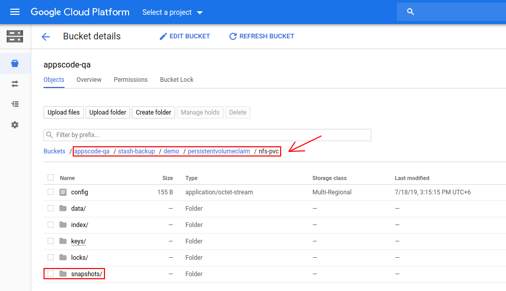



# Auto Backup for PVC

This tutorial will show you how to configure automatic backup for PersistentVolumeClaims. Here, we are going to backup a PVC provisioned from an NFS server using auto-backup.

## Before You Begin

- At first, you need to have a Kubernetes cluster, and the `kubectl` command-line tool must be configured to communicate with your cluster. If you do not already have a cluster, you can create one by using [kind](https://kind.sigs.k8s.io/docs/user/quick-start/).
- Install `Stash` in your cluster following the steps [here](/docs/setup/README.md).
- You will need to have a PVC with `ReadWriteMany` access permission. Here, we are going to use an NFS server to provision a PVC with `ReadWriteMany` access. If you don't have an NFS server running, deploy one by following the guide [here](https://github.com/appscode/third-party-tools/blob/master/storage/nfs/README.md).
- You should be familiar with the following `Stash` concepts:
  - [BackupBlueprint](/docs/concepts/crds/backupblueprint/index.md)
  - [BackupConfiguration](/docs/concepts/crds/backupconfiguration/index.md)
  - [BackupSession](/docs/concepts/crds/backupsession/index.md)
  - [Repository](/docs/concepts/crds/repository/index.md)
  - [Function](/docs/concepts/crds/function/index.md)
  - [Task](/docs/concepts/crds/task/index.md)

To keep everything isolated, we are going to use a separate namespace called `demo` throughout this tutorial.

```bash
$ kubectl create ns demo
namespace/demo created
```

>**Note:** YAML files used in this tutorial are stored in  [docs/guides/auto-backup/pvc/examples](/docs/guides/auto-backup/pvc/examples) directory of [stashed/docs](https://github.com/stashed/docs) repository.

**Verify necessary Function and Task:**

Stash uses a `Function-Task` model to automatically backup PVC. When you install Stash, it creates the necessary `Function` and `Task`.

Let's verify that Stash has created the necessary `Function` to backup/restore PVC by the following command,

```bash
$ kubectl get function
NAME            AGE
pvc-backup      6h55m
pvc-restore     6h55m
update-status   6h55m
```

Also, verify that the necessary `Task` has been created,

```bash
$ kubectl get task
NAME          AGE
pvc-backup    6h55m
pvc-restore   6h55m
```

## Prepare Backup Blueprint

We are going to use [GCS Backend](/docs/guides/backends/gcs.md) to store the backed up data. You can use any supported backend you prefer. You just have to configure Storage Secret and `spec.backend` section of `BackupBlueprint` to match your backend. To learn which backends are supported by Stash and how to configure them, please visit [here](/docs/guides/backends/overview.md).

> For GCS backend, if the bucket does not exist, Stash needs `Storage Object Admin` role permissions to create the bucket. For more details, please check the following [guide](/docs/guides/backends/gcs.md).

**Create Storage Secret:**

At first, let's create a Storage Secret for the GCS backend,

```bash
$ echo -n 'changeit' > RESTIC_PASSWORD
$ echo -n '<your-project-id>' > GOOGLE_PROJECT_ID
$ mv downloaded-sa-json.key GOOGLE_SERVICE_ACCOUNT_JSON_KEY
$ kubectl create secret generic -n demo gcs-secret \
    --from-file=./RESTIC_PASSWORD \
    --from-file=./GOOGLE_PROJECT_ID \
    --from-file=./GOOGLE_SERVICE_ACCOUNT_JSON_KEY
secret/gcs-secret created
```

**Create BackupBlueprint:**

Now, we have to create a `BackupBlueprint` crd with a blueprint for `Repository` and `BackupConfiguration` object.

Below is the YAML of the `BackupBlueprint` object that we are going to create,

```yaml
apiVersion: stash.appscode.com/v1beta1
kind: BackupBlueprint
metadata:
  name: pvc-backup-blueprint
spec:
  # ============== Blueprint for Repository ==========================
  backend:
    gcs:
      bucket: appscode-qa
      prefix: stash-backup/${TARGET_NAMESPACE}/${TARGET_KIND}/${TARGET_NAME}
    storageSecretName: gcs-secret
  # ============== Blueprint for BackupConfiguration =================
  task:
    name: pvc-backup
  schedule: "*/5 * * * *"
  retentionPolicy:
    name: 'keep-last-5'
    keepLast: 5
    prune: true
```

Here,

- `spec.task.name` specifies the `Task` crd name that will be used to backup the targeted PVC.

Note that we have used some variables (format: `${<variable name>}`) in `backend.gcs.prefix` field. Stash will substitute these variables with values from the respective target. To know which variable you can use in this `prefix` field, please visit [here](/docs/concepts/crds/backupblueprint/index.md#repository-blueprint).

Let's create the `BackupBlueprint` that we have shown above,

```bash
$ kubectl apply -f https://github.com/stashed/docs/raw//docs/guides/auto-backup/pvc/examples/backupblueprint.yaml
backupblueprint.stash.appscode.com/pvc-backup-blueprint created
```

Now, automatic backup is configured for PVC. We just have to add some annotations to the targeted PVC to enable backup.

**Available Auto-Backup Annotations for PVC:**

You have to add the auto-backup annotations to the PVC that you want to backup. The following auto-backup annotations are available for a PVC:

- **BackupBlueprint Name:** You have to specify the `BackupBlueprint` name that holds the template for `Repository` and `BackupConfiguration` in the following annotation:

```yaml
stash.appscode.com/backup-blueprint: <BackupBlueprint name>
```

- **Schedule:** You can specify a schedule to backup this target through this annotation. If you don't specify this annotation, schedule from the `BackupBlueprint` will be used.

```yaml
 stash.appscode.com/schedule: <Cron Expression>
```

## Prepare PVC

At first, let's prepare our desired PVC. Here, we are going to create a [PersistentVolume](https://kubernetes.io/docs/concepts/storage/persistent-volumes/) (PV) that will use an NFS server as storage. Then, we are going to create a PVC that will bind with the PV. Then, we are going to mount this PVC into a pod. This pod will generate a sample file into the PVC.

**Create PersistentVolume:**

We have deployed an NFS server in `storage` namespace and it is accessible through a Service named `nfs-service`. Now, we are going to create a PV that uses the NFS server as storage.

Below is the YAML of the PV that we are going to create,

```yaml
apiVersion: v1
kind: PersistentVolume
metadata:
  name: nfs-pv
  labels:
    app: nfs-demo
spec:
  capacity:
    storage: 1Gi
  accessModes:
  - ReadWriteMany
  nfs:
    server: "nfs-service.storage.svc.cluster.local"
    path: "/"
```

Notice the `metadata.labels` section. Here, we have added `app: nfs-demo` label. We are going to use this label as selector in PVC so that the PVC binds with this PV.

Let's create the PV we have shown above,

```bash
$ kubectl apply -f https://github.com/stashed/docs/raw//docs/guides/auto-backup/pvc/examples/nfs_pv.yaml
persistentvolume/nfs-pv created
```

**Create PersistentVolumeClaim:**

Now, create a PVC to bind with the PV we have just created. Below, is the YAML of the PVC that we are going to create,

```yaml
apiVersion: v1
kind: PersistentVolumeClaim
metadata:
  name: nfs-pvc
  namespace: demo
spec:
  accessModes:
  - ReadWriteMany
  storageClassName: ""
  resources:
    requests:
      storage: 1Gi
  selector:
    matchLabels:
      app: nfs-demo
```

Notice the `spec.accessModes` section. We are using `ReadWriteMany` access mode so that multiple pods can use this PVC simultaneously. Without this access mode, Stash will fail to backup the volume if any other pod mounts it during backup.

Also, notice the `spec.selector` section. We have specified `app: nfs-demo` labels as a selector so that it binds with the PV that we have created earlier.

Let's create the PVC we have shown above,

```bash
$ kubectl apply -f https://github.com/stashed/docs/raw//docs/guides/auto-backup/pvc/examples/nfs_pvc.yaml
persistentvolumeclaim/nfs-pvc created
```

Verify that the PVC has bounded with our desired PV,

```bash
$ kubectl get pvc -n demo nfs-pvc
NAME      STATUS   VOLUME   CAPACITY   ACCESS MODES   STORAGECLASS   AGE
nfs-pvc   Bound    nfs-pv   1Gi        RWX                           61s
```

Here, we can see that the PVC `nfs-pvc` has been bounded with PV `nfs-pv`.

**Generate Sample Data:**

Now, we are going to deploy two sample pods `demo-pod-1` and `demo-pod-2` that will mount `pod-1/data` and `pod-2/data` [subPath](https://kubernetes.io/docs/concepts/storage/volumes/#using-subpath) of the `nfs-pvc` respectively. Each of the pods will generate a sample file named `hello.txt` with some demo data. We are going to backup the entire PVC that contains the sample files using auto-backup.

Below, is the YAML of the first pod that we are going to deploy,

```yaml
kind: Pod
apiVersion: v1
metadata:
  name: demo-pod-1
  namespace: demo
spec:
  containers:
  - name: busybox
    image: busybox
    command: ["/bin/sh", "-c","echo 'hello from pod 1.' > /sample/data/hello.txt && sleep 3000"]
    volumeMounts:
    - name: my-volume
      mountPath: /sample/data
      subPath: pod-1/data
  volumes:
  - name: my-volume
    persistentVolumeClaim:
      claimName: nfs-pvc
```

Here, we have mounted `pod-1/data` directory of the `nfs-pvc` into `/sample/data` directory of this pod.

Let's deploy the pod we have shown above,

```bash
$ kubectl apply -f https://github.com/stashed/docs/raw//docs/guides/auto-backup/pvc/examples/pod-1.yaml
pod/demo-pod-1 created
```

Verify that the sample data has been generated into `/sample/data/` directory,

```bash
$ kubectl exec -n demo demo-pod-1 cat /sample/data/hello.txt
hello from pod 1.
```

Below is the YAML of the second pod that we are going to deploy,

```yaml
kind: Pod
apiVersion: v1
metadata:
  name: demo-pod-2
  namespace: demo
spec:
  containers:
  - name: busybox
    image: busybox
    command: ["/bin/sh", "-c","echo 'hello from pod 2.' > /sample/data/hello.txt && sleep 3000"]
    volumeMounts:
    - name: my-volume
      mountPath: /sample/data
      subPath: pod-2/data
  volumes:
  - name: my-volume
    persistentVolumeClaim:
      claimName: nfs-pvc
```

Now, we have mounted `pod-2/data` directory of the `nfs-pvc` into `/sample/data` directory of this pod.

Let's create the pod we have shown above,

```bash
$ kubectl apply -f https://github.com/stashed/docs/raw//docs/guides/auto-backup/pvc/examples/pod-2.yaml
pod/demo-pod-2 created
```

Verify that the sample data has been generated into `/sample/data/` directory,

```bash
$ kubectl exec -n demo demo-pod-2 cat /sample/data/hello.txt
hello from pod 2.
```

## Backup

Now, we are going to add auto backup specific annotation to the PVC. Stash watches for PVC with auto-backup annotations. Once it finds a PVC with auto-backup annotations, it will create a `Repository` and a `BackupConfiguration` crd according to respective `BackupBlueprint`. Then, rest of the backup process will proceed as normal backup of a stand-alone PVC as describe [here](/docs/guides/volumes/pvc.md).

**Add Annotations:**

Let's add the auto backup specific annotation to the PVC,

```bash
$ kubectl annotate pvc nfs-pvc -n demo --overwrite           \
    stash.appscode.com/backup-blueprint=pvc-backup-blueprint \
    stash.appscode.com/schedule="*/15 * * * *"
```

Verify that the annotations has been added successfully,

```bash
$ kubectl get pvc -n demo nfs-pvc -o yaml
```

```yaml
apiVersion: v1
kind: PersistentVolumeClaim
metadata:
  annotations:
    kubectl.kubernetes.io/last-applied-configuration: |
      {"apiVersion":"v1","kind":"PersistentVolumeClaim","metadata":{"annotations":{},"name":"nfs-pvc","namespace":"demo"},"spec":{"accessModes":["ReadWriteMany"],"resources":{"requests":{"storage":"1Gi"}},"selector":{"matchLabels":{"app":"nfs-demo"}},"storageClassName":""}}
    pv.kubernetes.io/bind-completed: "yes"
    pv.kubernetes.io/bound-by-controller: "yes"
    stash.appscode.com/backup-blueprint: pvc-backup-blueprint
    stash.appscode.com/schedule: "*/15 * * * *"
  creationTimestamp: "2019-08-19T09:08:44Z"
  finalizers:
  - kubernetes.io/pvc-protection
  name: nfs-pvc
  namespace: demo
  resourceVersion: "64082"
  selfLink: /api/v1/namespaces/demo/persistentvolumeclaims/nfs-pvc
  uid: 7c9dca87-8577-466a-bf2d-2fa7a83f85b7
spec:
  accessModes:
  - ReadWriteMany
  resources:
    requests:
      storage: 1Gi
  selector:
    matchLabels:
      app: nfs-demo
  storageClassName: ""
  volumeMode: Filesystem
  volumeName: nfs-pv
status:
  accessModes:
  - ReadWriteMany
  capacity:
    storage: 1Gi
  phase: Bound
```

Now, Stash will create a `Repository` crd and a `BackupConfiguration` crd according to the blueprint.

**Verify Repository:**

Verify that the `Repository` has been created successfully by the following command,

```bash
$ kubectl get repository -n demo
NAME                            INTEGRITY   SIZE   SNAPSHOT-COUNT   LAST-SUCCESSFUL-BACKUP   AGE
persistentvolumeclaim-nfs-pvc
```

If we view the YAML of this `Repository`, we are going to see that the variables `${TARGET_NAMESPACE}`, `${TARGET_KIND}` and `${TARGET_NAME}` has been replaced by `demo`, `presistentvolumeclaim` and `nfs-pvc` respectively.

```bash
$ kubectl get repository -n demo persistentvolumeclaim-nfs-pvc -o yaml
```

```yaml
apiVersion: stash.appscode.com/v1alpha1
kind: Repository
metadata:
  creationTimestamp: "2019-08-19T09:18:55Z"
  finalizers:
  - stash
  generation: 1
  name: persistentvolumeclaim-nfs-pvc
  namespace: demo
  resourceVersion: "64084"
  selfLink: /apis/stash.appscode.com/v1beta1/namespaces/demo/repositories/persistentvolumeclaim-nfs-pvc
  uid: a991373f-9d7a-4d02-a812-16f901497ebd
spec:
  backend:
    gcs:
      bucket: appscode-qa
      prefix: stash-backup/demo/persistentvolumeclaim/nfs-pvc
    storageSecretName: gcs-secret
```

**Verify BackupConfiguration:**
If everything goes well, Stash should create a `BackupConfiguration` for our Pvc and the phase of that `BackupConfiguration` should be `Ready`. Verify the `BackupConfiguration` crd by the following command,

```bash
$ kubectl get backupconfiguration -n demo
NAME                            TASK         SCHEDULE       PAUSED   PHASE   AGE
persistentvolumeclaim-nfs-pvc   pvc-backup   */15 * * * *            Ready   119s
```

Now, let's check the YAML of the `BackupConfiguration`.
```bash
$ kubectl get backupconfiguration -n demo persistentvolumeclaim-nfs-pvc -o yaml
```

```yaml
apiVersion: stash.appscode.com/v1beta1
kind: BackupConfiguration
metadata:
  creationTimestamp: "2019-08-20T13:01:54Z"
  finalizers:
  - stash.appscode.com
  generation: 1
  name: persistentvolumeclaim-nfs-pvc
  namespace: demo
  ownerReferences:
  - apiVersion: v1
    blockOwnerDeletion: false
    kind: PersistentVolumeClaim
    name: nfs-pvc
    uid: 7c9dca87-8577-466a-bf2d-2fa7a83f85b7
  resourceVersion: "124087"
  selfLink: /apis/stash.appscode.com/v1beta1/namespaces/demo/backupconfigurations/persistentvolumeclaim-nfs-pvc
  uid: 6270ab3f-c967-431b-8e4c-c19fafa44a64
spec:
  repository:
    name: persistentvolumeclaim-nfs-pvc
  retentionPolicy:
    keepLast: 5
    name: keep-last-5
    prune: true
  runtimeSettings: {}
  schedule: '*/15 * * * *'
  target:
    ref:
      apiVersion: v1
      kind: PersistentVolumeClaim
      name: nfs-pvc
  task:
    name: pvc-backup
  tempDir: {}
```

Notice that the `spec.target.ref` is pointing to the `nfs-pvc` PVC.

**Wait for BackupSession:**

Now, wait for the next backup schedule. Run the following command to watch `BackupSession` crd:

```bash
$ watch -n 1 kubectl get backupsession -n demo -l=stash.appscode.com/backup-configuration=persistentvolumeclaim-nfs-pvc

Every 1.0s: kubectl get backupsession -n demo ... workstation: Thu Jul 18 15:18:42 2019

NAME                                       INVOKER-TYPE          INVOKER-NAME                    PHASE       AGE
persistentvolumeclaim-nfs-pvc-1563441309   BackupConfiguration   persistentvolumeclaim-nfs-pvc   Succeeded   3m33s
```

>Note: Respective CronJob creates `BackupSession` crd with the following label `stash.appscode.com/backup-configuration=<BackupConfiguration crd name>`. We can use this label to watch only the `BackupSession` of our desired `BackupConfiguration`.

**Verify Backup:**

When backup session is completed, Stash will update the respective `Repository` to reflect the latest state of backed up data.

Run the following command to check if a snapshot has been sent to the backend,

```bash
$ kubectl get repository -n demo persistentvolumeclaim-nfs-pvc
NAME                            INTEGRITY   SIZE   SNAPSHOT-COUNT   LAST-SUCCESSFUL-BACKUP   AGE
persistentvolumeclaim-nfs-pvc   true        41 B   1                3m37s                    5m11s
```

> Stash creates one snapshot for each targeted file path. Since we are taking backup of two file paths, two snapshots have been created for this BackupSession.

If we navigate to `stash-backup/demo/persistentvolumeclaim/nfs-pvc` directory of our GCS bucket, we are going to see that the snapshot has been stored there.

<figure align="center">
  
  <figcaption align="center">Fig: Backup data of PVC "nfs-pvc" in GCS backend</figcaption>
</figure>

## Cleanup

To cleanup the Kubernetes resources created by this tutorial, run:

```bash
kubectl delete -n demo backupBlueprint/pvc-backup-blueprint
kubectl delete -n demo repository/persistentvolumeclaim-nfs-pvc
kubectl delete -n demo backupconfiguration/persistentvolumeclaim-nfs-pvc

kubectl delete -n demo pod/demo-pod
kubectl delete -n demo pvc/nfs-pvc
kubectl delete -n demo pv/nfs-pv
```

If you would like to uninstall Stash operator, please follow the steps [here](/docs/setup/README.md).
