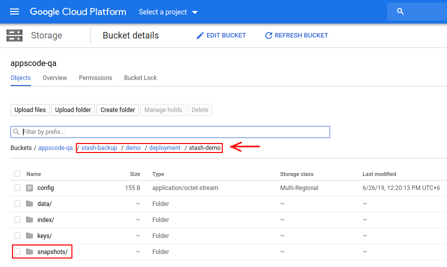



# Auto Backup for Workloads

This tutorial will show you how to configure automatic backup for Kubernetes workloads. Here, we are going to show a demo on how we can backup Deployments, StatefulSets, and DaemonSets using a common blueprint.

## Before You Begin

- At first, you need to have a Kubernetes cluster, and the `kubectl` command-line tool must be configured to communicate with your cluster. If you do not already have a cluster, you can create one using [kind](https://kind.sigs.k8s.io/docs/user/quick-start/).

- Install `Stash` in your cluster following the steps [here](/docs/setup/README.md).

- You should be familiar with the following Stash concepts:
  - [Repository](/docs/concepts/crds/repository.md)
  - [BackupConfiguration](/docs/concepts/crds/backupconfiguration.md)
  - [BackupBlueprint](/docs/concepts/crds/backupblueprint.md)
  - [BackupSession](/docs/concepts/crds/backupsession.md)

To keep things isolated, we are going to use a separate namespace called `demo` throughout this tutorial.

```bash
$ kubectl create namespace demo
namespace/demo created
```

## Prepare Backup Blueprint

We are going to use [GCS Backend](/docs/guides/backends/gcs.md) to store the backed up data. You can use any supported backend you prefer. You just have to configure Storage Secret and `spec.backend` section of `BackupBlueprint` to match your backend. To learn which backends are supported by Stash and how to configure them, please visit [here](/docs/guides/backends/overview.md).

> For GCS backend, if the bucket does not exist, Stash needs `Storage Object Admin` role permissions to create the bucket. For more details, please check the following [guide](/docs/guides/backends/gcs.md).

**Create Storage Secret:**

At first, let's create a Storage Secret for the GCS backend,

```bash
$ echo -n 'changeit' > RESTIC_PASSWORD
$ echo -n '<your-project-id>' > GOOGLE_PROJECT_ID
$ mv downloaded-sa-json.key GOOGLE_SERVICE_ACCOUNT_JSON_KEY
$ kubectl create secret generic -n demo gcs-secret \
    --from-file=./RESTIC_PASSWORD \
    --from-file=./GOOGLE_PROJECT_ID \
    --from-file=./GOOGLE_SERVICE_ACCOUNT_JSON_KEY
secret/gcs-secret created
```

**Create BackupBlueprint:**

Now, we have to create a `BackupBlueprint` crd with a blueprint for `Repository` and `BackupConfiguration` object.

Below is the YAML of the `BackupBlueprint` object that we are going to create,

```yaml
apiVersion: stash.appscode.com/v1beta1
kind: BackupBlueprint
metadata:
  name: workload-backup-blueprint
spec:
  # ============== Blueprint for Repository ==========================
  backend:
    gcs:
      bucket: appscode-qa
      prefix: stash-backup/${TARGET_NAMESPACE}/${TARGET_KIND}/${TARGET_NAME}
    storageSecretName: gcs-secret
  # ============== Blueprint for BackupConfiguration =================
  schedule: "*/5 * * * *"
  retentionPolicy:
    name: 'keep-last-5'
    keepLast: 5
    prune: true
```

Note that we have used some variables (format: `${<variable name>}`) in `backend.gcs.prefix` field. Stash will substitute these variables with values from the respective target. Since the resolved prefix will be different for different workload, the backed up data will be stored in different directory inside the bucket. To know which variable you can use in this `prefix` field, please visit [here](/docs/concepts/crds/backupblueprint.md#repository-blueprint).

Let's create the `BackupBlueprint` that we have shown above,

```bash
$ kubectl apply -f https://github.com/stashed/docs/raw//docs/guides/auto-backup/workload/examples/backupblueprint.yaml
backupblueprint.stash.appscode.com/workload-backup-blueprint created
```

Now, automatic backup is configured for Kubernetes workloads (`Deployment`, `StatefulSet`, `DaemonSet` etc.). We just have to add some annotations to the targeted workload to enable periodic backup.

**Available Auto-Backup Annotations for Workloads:**

You have to add the auto-backup annotations to the workload that you want to backup. The following auto-backup annotations are available for a workload:

- **BackupBlueprint Name:** You have to specify the `BackupBlueprint` name that holds the template for `Repository` and `BackupConfiguration` in the following annotation:

```yaml
stash.appscode.com/backup-blueprint: <BackupBlueprint name>
```

- **Schedule:** You can specify a schedule to backup this target through this annotation. If you don't specify this annotation, schedule from the `BackupBlueprint` will be used.

```yaml
 stash.appscode.com/schedule: <Cron Expression>
```

- **Target Paths:** You have to specify a list of paths that you want to backup through this annotation. Use comma (`,`) to separate multiple file paths. For example, `"/my/target/dir-1,/my/target/dir-2"`.

```yaml
stash.appscode.com/target-paths: "<paths to backup>"
```

- **Volume Mounts:** You have to also specify a list of Volumes and their MountPath and SubPath where the targeted paths are located. Use `"<volumenName>:<mountPath>:<subPath>"` format to specify the volumes. The `:<subPath>` part is optional. Use comma (`,`) to specify multiple volumes and mount path. For example, `"vol-1:/mount/path-1:sub/path-1,vol-2:/mount/path-2"`.

```yaml
stash.appscode.com/volume-mounts: "<volume>:<mountPath>:<subPath (optional)>"
```

## Backup Deployment

Now, we are going to backup a Deployment using the blueprint we have configured earlier. We are going to mount two ConfigMap volume in two different directories of the Deployment. Then, we are going to backup those directories using automatic backup.

**Create Deployment:**

Below is the YAML of the Deployment and respective ConfigMaps that we are going to create,

```yaml
apiVersion: v1
kind: ConfigMap
metadata:
  name: stash-sample-data-1
  namespace: demo
data:
  file1.txt: "Data from ConfigMap 'stash-sample-data-1'"
---
apiVersion: v1
kind: ConfigMap
metadata:
  name: stash-sample-data-2
  namespace: demo
data:
  file2.txt: "Data from ConfigMap 'stash-sample-data-2'"
---
apiVersion: apps/v1
kind: Deployment
metadata:
  labels:
    app: stash-demo
  name: stash-demo
  namespace: demo
  annotations:
    stash.appscode.com/backup-blueprint: workload-backup-blueprint
    stash.appscode.com/target-paths: "/source/data-1,/source/data-2"
    stash.appscode.com/volume-mounts: "source-data-1:/source/data-1,source-data-2:/source/data-2"
    stash.appscode.com/schedule: "*/15 * * * *"
spec:
  replicas: 3
  selector:
    matchLabels:
      app: stash-demo
  template:
    metadata:
      labels:
        app: stash-demo
      name: busybox
    spec:
      containers:
      - args:
        - sleep
        - "3600"
        image: busybox
        imagePullPolicy: IfNotPresent
        name: busybox
        volumeMounts:
        - mountPath: /source/data-1
          name: source-data-1
        - mountPath: /source/data-2
          name: source-data-2
      restartPolicy: Always
      volumes:
      - name: source-data-1
        configMap:
          name: stash-sample-data-1
      - name: source-data-2
        configMap:
          name: stash-sample-data-2
```

Notice the `metadata.annotations` field. We have specified the automatic backup specific annotations to backup `/source/data-1` and `/source/data-2` directories of the `source-data-1` and `source-data-2` volumes respectively. We have also specified to use `workload-backup-blueprint` BackupBlueprint for creating `Repository` and `BackupConfiguration` for this Deployment. BackupBlueprint is a non-namespaced resource, so we just need to specify the name of the blueprint.

Let's create the above Deployment,

```bash
$ kubectl apply -f https://github.com/stashed/docs/raw//docs/guides/auto-backup/workload/examples/deployment.yaml
configmap/stash-sample-data-1 created
configmap/stash-sample-data-2 created
deployment.apps/stash-demo created
```

If everything goes well, Stash will create a `Repository` and a `BackupConfiguration` with the name in the following format: `<workload-kind>-<workload-name>`.

**Verify Repository:**

Verify that the Repository has been created successfully by the following command,

```bash
$ kubectl get repository -n demo
NAME                    INTEGRITY   SIZE   SNAPSHOT-COUNT   LAST-SUCCESSFUL-BACKUP   AGE
deployment-stash-demo                                                                9s
```

If we view the YAML of this Repository, we are going to see that the variables `${TARGET_NAMESPACE}`, `${TARGET_KIND}` and `${TARGET_NAME}` has been replaced by `demo`, `deployment` and `stash-demo` respectively.

```bash
$ kubectl get repository -n demo deployment-stash-demo -o yaml
```

```yaml
apiVersion: stash.appscode.com/v1alpha1
kind: Repository
metadata:
  name: deployment-stash-demo
  namespace: demo
  ...
spec:
  backend:
    gcs:
      bucket: appscode-qa
      prefix: stash-backup/demo/deployment/stash-demo
    storageSecretName: gcs-secret
```

**Verify BackupConfiguratoin:**

If everything goes well, Stash should create a `BackupConfiguration` for our Deployment and the phase of that `BackupConfiguration` should be `Ready`. Verify that the `BackupConfiguration` has been created by the following command,

```bash
$ kubectl get backupconfiguration -n demo
NAME                    TASK   SCHEDULE       PAUSED   PHASE   AGE
deployment-stash-demo          */15 * * * *            Ready   19s
```

Let's check the YAML of this `BackupConfiguration`,

```bash
$ kubectl get backupconfiguration -n demo deployment-stash-demo -o yaml
```

```yaml
apiVersion: stash.appscode.com/v1beta1
kind: BackupConfiguration
metadata:
  name: deployment-stash-demo
  namespace: demo
  ...
spec:
  repository:
    name: deployment-stash-demo
  retentionPolicy:
    keepLast: 5
    name: keep-last-5
    prune: true
  runtimeSettings: {}
  schedule: '*/15 * * * *'
  target:
    paths:
    - /source/data-1
    - /source/data-2
    ref:
      apiVersion: apps/v1
      kind: Deployment
      name: stash-demo
    volumeMounts:
    - mountPath: /source/data-1
      name: source-data-1
    - mountPath: /source/data-2
      name: source-data-2
  task: {}
  tempDir: {}
```

Notice that the `spec.target.ref` is pointing to the `stash-demo` Deployment. Also, notice that the `spec.target.paths` and `spec.target.volumeMounts` fields have been populated with the information we had provided as annotation of the Deployment.

**Wait for BackupSession:**

Now, wait for the next backup schedule. Run the following command to watch `BackupSession` crd:

```bash
$ watch -n 1 kubectl get backupsession -n demo -l=stash.appscode.com/backup-configuration=deployment-stash-demo

Every 1.0s: kubectl get backupsession -n demo                                   workstation: Wed Jun 26 12:20:31 2019
NAME                               INVOKER-TYPE          INVOKER-NAME            PHASE       AGE
deployment-stash-demo-1561530008   BackupConfiguration   deployment-stash-demo   Succeeded   61s
```

>Note: Respective CronJob creates `BackupSession` crd with the following label `stash.appscode.com/backup-configuration=<BackupConfiguration crd name>`. We can use this label to watch only the `BackupSession` of our desired `BackupConfiguration`.

**Verify Backup:**

When backup session is completed, Stash will update the respective `Repository` to reflect the latest state of backed up data.

Run the following command to check if the snapshots are stored in the backend,

```bash
$ kubectl get repository -n demo deployment-stash-demo
NAME                    INTEGRITY   SIZE    SNAPSHOT-COUNT   LAST-SUCCESSFUL-BACKUP   AGE
deployment-stash-demo   true        246 B   2                70s                      5m
```

> Stash creates one snapshot for each targeted file path. Since we are taking backup of two file paths, two snapshots have been created for this BackupSession.

If we navigate to `stash-backup/demo/deployment/stash-demo` directory of our GCS bucket, we are going to see that the snapshot has been stored there.

<figure align="center">
  
  <figcaption align="center">Fig: Backup data in GCS backend</figcaption>
</figure>

>Stash keeps all backup data encrypted. So, snapshot files in the bucket will not contain any meaningful data until they are decrypted.

## Backup StatefulSet

Now, we are going to backup a StatefulSet with the same blueprint we have used to backup Deployment in the previous section.

**Create StatefulSet:**

We are going to create a StatefulSet with 3 replicas. We are going to configure the StatefulSet to generate sample data in each replica.

Below is the YAML of the StatefulSet that we are going to create,

```yaml
apiVersion: v1
kind: Service
metadata:
  name: headless
  namespace: demo
spec:
  ports:
  - name: http
    port: 80
    targetPort: 0
  selector:
    app: stash-demo
  clusterIP: None
---
apiVersion: apps/v1
kind: StatefulSet
metadata:
  name: sts-demo
  namespace: demo
  labels:
    app: stash-demo
  annotations:
    stash.appscode.com/backup-blueprint: workload-backup-blueprint
    stash.appscode.com/target-paths: "/source/data-1,/source/data-2"
    stash.appscode.com/volume-mounts: "source-data-1:/source/data-1,source-data-2:/source/data-2"
spec:
  replicas: 3
  selector:
    matchLabels:
      app: stash-demo
  serviceName: headless
  template:
    metadata:
      labels:
        app: stash-demo
    spec:
      containers:
      - name: busybox
        image: busybox
        command: ["/bin/sh", "-c"]
        args: ["touch /source/data-1/sample-file-1.txt && touch /source/data-2/sample-file-2.txt && sleep 3000"]
        imagePullPolicy: IfNotPresent
        volumeMounts:
        - mountPath: /source/data-1
          name: source-data-1
        - mountPath: /source/data-2
          name:  source-data-2
  volumeClaimTemplates:
  - metadata:
      name: source-data-1
    spec:
      accessModes: [ "ReadWriteOnce" ]
      storageClassName: "standard"
      resources:
        requests:
          storage: 1Gi
  - metadata:
      name: source-data-2
    spec:
      accessModes: [ "ReadWriteOnce" ]
      storageClassName: "standard"
      resources:
        requests:
          storage: 1Gi
```

Notice the `metadata.annotations` field. We have specified automatic backup specific annotations similarly as we had specified in the Deployment in the previous section.

Let's create the StatefulSet we have created above,

```bash
$ kubectl apply -f https://github.com/stashed/docs/raw//docs/guides/auto-backup/workload/examples/statefulset.yaml
service/headless created
statefulset.apps/sts-demo created
```

**Verify Repository:**

Verify that a Repository has been created for this StatefulSet using the following command,

```bash
$ kubectl get repository -n demo
NAME                    INTEGRITY   SIZE    SNAPSHOT-COUNT   LAST-SUCCESSFUL-BACKUP   AGE
deployment-stash-demo   true        410 B   10               14s                      39m
statefulset-sts-demo                                                                  31s
```

Here, `statefulset-sts-demo` Repository has been created for our `sts-demo` StatefulSet.

Let's view the YAML of the Repository,

```bash
$ kubectl get repository -n demo statefulset-sts-demo -o yaml
```

```yaml
apiVersion: stash.appscode.com/v1alpha1
kind: Repository
metadata:
  name: statefulset-sts-demo
  namespace: demo
  ...
spec:
  backend:
    gcs:
      bucket: appscode-qa
      prefix: stash-backup/demo/statefulset/sts-demo
    storageSecretName: gcs-secret
```

Notice that the variables of the `prefix` field of `BackupBlueprint` is now replaced with `demo`, `statefulset` and `sts-demo` respectively.

**Verify BackupConfiguratoin:**

Verify that a `BackupConfiguration` has been created and in `Ready` Phase for this StatefulSet using the following command,

```bash
$ kubectl get backupconfiguration -n demo
NAME                    TASK   SCHEDULE      PAUSED   PHASE   AGE
deployment-stash-demo          */5 * * * *            Ready   40m
statefulset-sts-demo           */5 * * * *            Ready   105s
```

Here, `statefulset-sts-demo` has been created for the StatefulSet `sts-demo`. You can check the YAML of this `BackupConfiguration` to see that the target field is pointing to this StatefulSet.

```bash
$ kubectl get backupconfiguration -n demo statefulset-sts-demo -o yaml
```

```yaml
apiVersion: stash.appscode.com/v1beta1
kind: BackupConfiguration
metadata:
  name: statefulset-sts-demo
  namespace: demo
  ...
spec:
  repository:
    name: statefulset-sts-demo
  retentionPolicy:
    keepLast: 5
    name: keep-last-5
    prune: true
  runtimeSettings: {}
  schedule: '*/5 * * * *'
  target:
    paths:
    - /source/data-1
    - /source/data-2
    ref:
      apiVersion: apps/v1
      kind: StatefulSet
      name: sts-demo
    volumeMounts:
    - mountPath: /source/data-1
      name: source-data-1
    - mountPath: /source/data-2
      name: source-data-2
  task: {}
  tempDir: {}
```

**Wait for BackupSession:**

Now, wait for the next backup schedule. Watch the `BackupSession` of the BackupConfiguration `statefulset-sts-demo` using the following command,

```bash
$ watch -n 1 kubectl get backupsession -n demo -l=stash.appscode.com/backup-configuration=statefulset-sts-demo
Every 1.0s: kubectl get backupsession -n demo -l=stash.appscode.com/backup-...  workstation: Wed Jun 26 13:01:22 2019

NAME                              INVOKER-TYPE          INVOKER-NAME           PHASE       AGE
statefulset-sts-demo-1561532403   BackupConfiguration   statefulset-sts-demo   Succeeded   2m21s
```

**Verify Backup:**

Once the backup session is completed, verify that the `Repository` has been updated to reflect the backup using the following command,

```bash
$ kubectl get repository -n demo statefulset-sts-demo
NAME                   INTEGRITY   SIZE   SNAPSHOT-COUNT   LAST-SUCCESSFUL-BACKUP   AGE
statefulset-sts-demo   true        0 B    6                32s                      7m29s
```

>For StatfulSet, Stash takes backup from every replica. Since we are using a StatefulSet with 3 replicas and we are taking backup of 2 file paths, total 6 snapshots have been created for this BackupSession.

If we navigate to `stash-backup/demo/statefulset/sts-demo` directory of our GCS bucket, we are going to see that the snapshot been stored there.

<figure align="center">
  
  <figcaption align="center">Fig: Backup data of StatefulSet "sts-demo" in GCS backend</figcaption>
</figure>

## Backup DaemonSet

Now, we are going to use the same blueprint to backup a DaemonSet. We are going to mount a ConfigMap in `/etc/config` directory. Then, we are going to backup this directory using automatic backup.

**Create DaemonSet:**

Below is the YAML of the DaemonSet that we are going to create,

```yaml
apiVersion: v1
kind: ConfigMap
metadata:
  name: my-daemon-config
  namespace: demo
data:
  config-file-1.txt: "This is first config file"
  config-file-2.txt: "This is second config file"
---
apiVersion: apps/v1
kind: DaemonSet
metadata:
  labels:
    app: stash-demo
  name: dmn-demo
  namespace: demo
  annotations:
    stash.appscode.com/backup-blueprint: workload-backup-blueprint
    stash.appscode.com/target-paths: "/etc/config"
    stash.appscode.com/volume-mounts: "dmn-config:/etc/config"
spec:
  selector:
    matchLabels:
      app: stash-demo
  template:
    metadata:
      labels:
        app: stash-demo
      name: busybox
    spec:
      containers:
      - name: busybox
        args:
        - sleep
        - "3600"
        image: busybox
        imagePullPolicy: IfNotPresent
        volumeMounts:
        - mountPath: /etc/config
          name: dmn-config
      restartPolicy: Always
      volumes:
      - name: dmn-config
        configMap:
          name: my-daemon-config
```

Notice the `metadata.annotations` field. We have specified automatic backup specific annotations to backup our desired file path.

Let's create the DaemonSet we have shown above,

```bash
$ kubectl apply -f https://github.com/stashed/docs/raw//docs/guides/auto-backup/workload/examples/daemonset.yaml
configmap/my-daemon-config created
daemonset.apps/dmn-demo created
```

**Verify Repository:**

Verify that a `Repository` has been created for this DaemonSet using the following command,

```bash
$ kubectl get repository -n demo
NAME                    INTEGRITY   SIZE    SNAPSHOT-COUNT   LAST-SUCCESSFUL-BACKUP   AGE
daemonset-dmn-demo                                                                    28s
deployment-stash-demo   true        410 B   10               6m3s                     70m
statefulset-sts-demo    true        0 B     26               6m6s                     31m
```

Here, `daemonset-dmn-demo` Repository has been created for our `dmn-demo` DaemonSet.

Let's view the YAML of the Repository,

```bash
$ kubectl get repository -n demo daemonset-dmn-demo -o yaml
```

```yaml
apiVersion: stash.appscode.com/v1alpha1
kind: Repository
metadata:
  name: daemonset-dmn-demo
  namespace: demo
  ...
spec:
  backend:
    gcs:
      bucket: appscode-qa
      prefix: stash-backup/demo/daemonset/dmn-demo
    storageSecretName: gcs-secret
```

**Verify BackupConfiguratoin:**
If everything goes well, Stash should create a `BackupConfiguration` for our DaemonSet and the phase of that `BackupConfiguration` should be `Ready`. Verify the `BackupConfiguration` crd by the following command,

```bash
$  kubectl get backupconfiguration -n demo
NAME                    TASK   SCHEDULE      PAUSED   PHASE   AGE
daemonset-dmn-demo             */5 * * * *            Ready   90s
deployment-stash-demo          */5 * * * *            Ready   71m
statefulset-sts-demo           */5 * * * *            Ready   32m
```

Here, `daemonset-dmn-demo` has been created for the DaemonSet `dmn-demo`. You can check the YAML of this `BackupConfiguration` to see that the target field is pointing to this DaemonSet.

```bash
$ kubectl get backupconfiguration -n demo daemonset-dmn-demo -o yaml
```

```yaml
apiVersion: stash.appscode.com/v1beta1
kind: BackupConfiguration
metadata:
  name: daemonset-dmn-demo
  namespace: demo
  ...
spec:
  repository:
    name: daemonset-dmn-demo
  retentionPolicy:
    keepLast: 5
    name: keep-last-5
    prune: true
  runtimeSettings: {}
  schedule: '*/5 * * * *'
  target:
    paths:
    - /etc/config
    ref:
      apiVersion: apps/v1
      kind: DaemonSet
      name: dmn-demo
    volumeMounts:
    - mountPath: /etc/config
      name: dmn-config
  task: {}
  tempDir: {}
```

**Wait for BackupSession:**

Now, wait for the next backup schedule. Watch the `BackupSession` of the BackupConfiguration `daemonset-dmn-demo` using the following command,

```bash
$ watch -n 1 kubectl get backupsession -n demo -l=stash.appscode.com/backup-configuration=daemonset-dmn-demo

Every 1.0s: kubectl get backupsession -n demo -l=stash.appscode.com/backup-...  workstation: Wed Jun 26 13:30:14 2019

NAME                            INVOKER-TYPE          INVOKER-NAME         PHASE       AGE
daemonset-dmn-demo-1561534208   BackupConfiguration   daemonset-dmn-demo   Succeeded   45s
```

**Verify Backup:**

Once the backup session is completed, verify that the `Repository` has been updated to reflect the backup using the following command,

```bash
$ kubectl get repository -n demo daemonset-dmn-demo
NAME                 INTEGRITY   SIZE   SNAPSHOT-COUNT   LAST-SUCCESSFUL-BACKUP   AGE
daemonset-dmn-demo   true        51 B   1                5s                       4m27s
```

>For DaemonSet, Stash takes backup from every daemon pod running on different nodes. Since we are using a single node cluster (Minikube), only 1 snapshot has been created for this BackupSession.

If we navigate to `stash-backup/demo/daemonset/dmn-demo` directory of our GCS bucket, we are going to see that the snapshot been stored there.

<figure align="center">
  
  <figcaption align="center">Fig: Backup data of DaemonSet "dmn-demo" in GCS backend</figcaption>
</figure>

## Cleanup

To cleanup the Kubernetes resources created by this tutorial, run:

```bash
kubectl delete -n demo deployment/stash-demo
kubectl delete -n demo statefulset/sts-demo
kubectl delete -n demo daemonset/dmn-demo

kubectl delete -n demo repository --all
kubectl delete -n demo secret/gcs-secret
kubectl delete -n demo backupblueprint/workload-backup-blueprint
```

If you would like to uninstall Stash operator, please follow the steps [here](/docs/setup/README.md).
