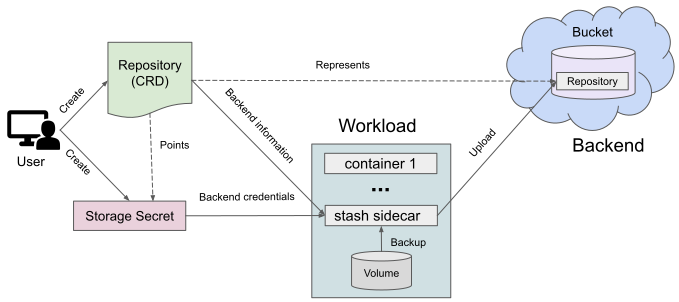
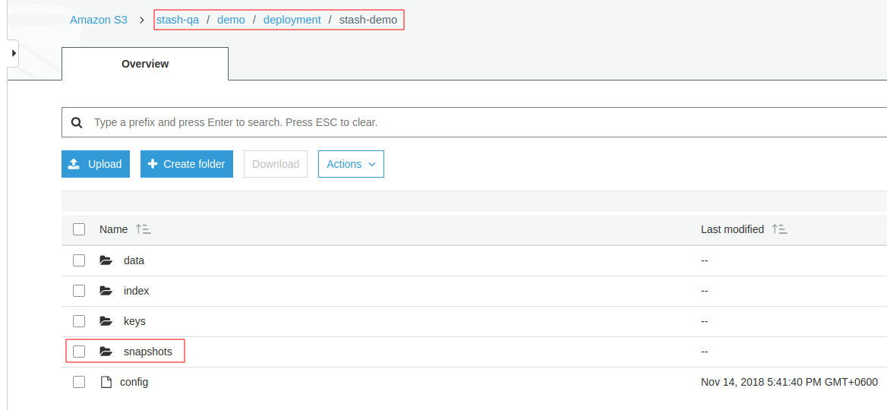

> New to Stash? Please start [here](/docs/concepts/README.md).

# Stash Backends

Stash supports various backends for storing data snapshots. It can be a cloud storage like GCS bucket, AWS S3, Azure Blob Storage etc. or a Kubernetes persistent volume like [HostPath](https://kubernetes.io/docs/concepts/storage/volumes/#hostpath), [PersistentVolumeClaim](https://kubernetes.io/docs/concepts/storage/volumes/#persistentvolumeclaim), [NFS](https://kubernetes.io/docs/concepts/storage/volumes/#nfs) etc.

The following diagram shows how Stash sidecar container accesses and backs up data into a backend.

<figure align="center">
  
  <figcaption align="center">Fig: Stash Backend Overview</figcaption>
</figure>

You have to create a [Repository](/docs/concepts/crds/repository/index.md) object which contains backend information and a `Secret` which contains necessary credentials to access the backend.

Stash sidecar/backup job reads backend information from the `Repository` and retrieves access credentials from the `Secret`. Then on the first backup session, Stash will initialize a repository in the backend.

Below, a screenshot that shows a repository created in AWS S3 bucket named `stash-qa`:

<figure align="center">
  
  <figcaption align="center">Fig: Repository in AWS S3 Backend</figcaption>
</figure>

You will see all snapshots taken by Stash at `/snapshot` directory of this repository.

> Note: Stash stores data encrypted at rest. So, snapshot files in the bucket will not contain any meaningful data until they are decrypted.

## Next Steps

- Learn how to configure `Kubernetes Volume` as backend from [here](/docs/guides/backends/local/index.md).
- Learn how to configure `AWS S3/Minio/Rook` backend from [here](/docs/guides/backends/s3/index.md).
- Learn how to configure `Google Cloud Storage (GCS)` backend from [here](/docs/guides/backends/gcs/index.md).
- Learn how to configure `Microsoft Azure Storage` backend from [here](/docs/guides/backends/azure/index.md).
- Learn how to configure `OpenStack Swift` backend from [here](/docs/guides/backends/swift/index.md).
- Learn how to configure `Backblaze B2` backend from [here](/docs/guides/backends/b2/index.md).
- Learn how to configure `REST` backend from [here](/docs/guides/backends/rest/index.md).
