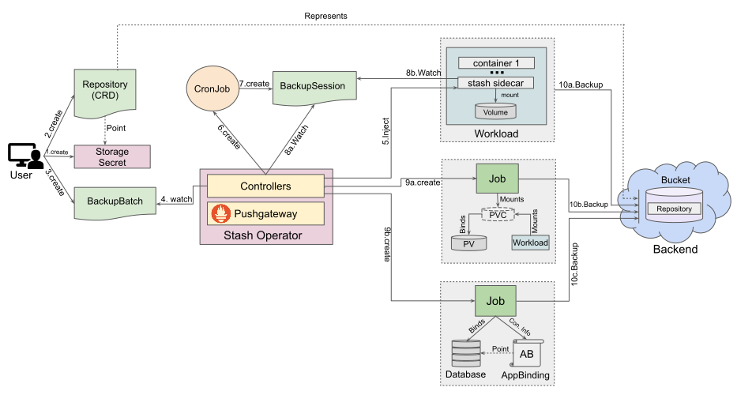



# Batch Backup and Restore Overview

Sometimes, an application may consist of multiple co-related components. For example, to deploy a WordPress, you will need a Deployment for the WordPress and another Deployment for the database. Now, it is sensible to want to backup or restore both of the deployments using a single configuration as they are parts of the same application.

Stash 0.9.0+ supports taking backup multiple co-related components using a single configuration known as [BackupBatch](/docs/concepts/crds/backupbatch/index.md). Stash 0.10.0+ supports restoring multiple co-related components together known as [RestoreBatch](/docs/concepts/crds/restorebatch/index.md) This guide will give you an overview of how batch backup and restore works in Stash.

## How Batch Backup Works

The following diagram shows how Stash takes backup of multiple co-related components in a single application. Open the image in a new tab to see the enlarged version.

<figure align="center">
  
<figcaption align="center">Fig: Batch backup flow in Stash</figcaption>
</figure>

The backup process consists of the following steps:

1. At first, a user creates a backend Secret. This secret holds the credentials to access the backend where the backed up data will be stored.

2. Then, she creates a `Repository` crd which represents the original repository in the backend.

3. Then, she creates a `BackupBatch` crd which specifies multiple targets(workload, volume, and database). It also specifies the `Repository` object that holds the backend information where the backed up data will be stored.

4. Stash operator watches for `BackupBatch` objects.

5. When it finds a `BackupBatch` object, it checks if there is any workload as a target. If there any, it injects a sidecar named `stash` into the workloads.

6. It also creates a `CronJob` to trigger backups periodically.

7. The`CronJob` triggers backup on each scheduled slot by creating a `BackupSession` crd.

8. The BackupSession controller (inside sidecar for sidecar model or inside the operator itself for job model) watches for `BackupSession` crd.

9. When it finds a `BackupSession` it starts the backup process immediately(for job model a job is created for taking backup) for the individual targets. Stash operator enforces the backup order if the `executionOrder` is set to `Sequential`.

10. The individual targets complete their backup process independently and update their respective fields in `BackupSession` status.

## How Batch Restore Works

The following diagram shows the batch restore process. Please, open image in new tab to view the enlarged image.

<figure align="center">
  
<figcaption align="center">Fig: Batch restore flow in Stash</figcaption>
</figure>

The batch restore process consists of the following steps:

1. At first, the user creates a `RestoreBatch` CR specifying the targets and the respective Repository where the backed up data has been stored.
2. The Stash operator watches for the `RestoreBatch` CR.
3. When the Stash operator finds a `RestoreBatch` CR, it executes the global `PreRestore` hooks. If there is no global `PreRestore` hook, Stash will skip this step.
4. Then, it injects an init-container into the target that follows the sidecar model and creates a restore job for the targets that follow the job model. Stash operator enforces the restore order in this step if the `executionOrder` is set to `Sequential`.
5. The restore init-container/job first execute their local `PreRestore` hooks. Then, restore their data and finally execute their `PostRestore` hooks.
6. Finally, Stash operator executes the global `PostRestore` hooks. If there is not global `PostRestore` hook configured for this RestoreBatch, Stash will skip this step.

## Next Steps

- See a step by step guide to backup application with multiple co-related components [here](/docs/guides/batch-backup/batch-backup/index.md).
