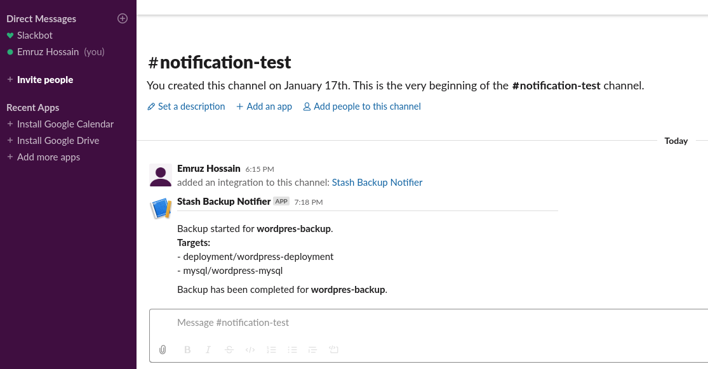



# Hooks in Batch Backup

Stash 0.9.0+ supports taking backup of multiple co-related stateful workloads using a single configuration named `BackupBatch`. Combining with backup hooks, this can be very powerful. For example, you can prepare your application stack before backup to ensure backup integrity or you can send a notification to a webhook (i.e. in a Slack channel via slack incoming webhook) before or after the backup of all the resources of your application stack.

Here, we are going to demonstrate how to send a notification to a Slack channel before and after the backup of a WordPress application. WordPress application consists of two different workloads. One is for WordPress itself and another for a MySQL database.

> Note that, this is an advanced concept. If you haven't tried the normal backup restore processes yet, we will recommend to try them first.

## Before You Begin

- At first, you need to have a Kubernetes cluster, and the `kubectl` command-line tool must be configured to communicate with your cluster. If you do not already have a cluster, you can create one by using [kind](https://kind.sigs.k8s.io/docs/user/quick-start/).
- Install Stash Enterprise in your cluster following the steps [here](/docs/setup/install/enterprise.md).
- Install [KubeDB](https://kubedb.com) in your cluster following the steps [here](https://kubedb.com/docs/latest/setup/). This step is optional. You can deploy your database using any method you want. We are using KubeDB because KubeDB simplifies many of the difficult or tedious management tasks of running production-grade databases on private and public clouds.
- If you are not familiar with how Stash backup and restore MySQL databases, please check the following guide [here](/docs/addons/mysql/overview/index.md).
- Also, if you haven't read about how hooks work in Stash, please check it from [here](/docs/guides/hooks/overview/index.md).

You should be familiar with the following `Stash` concepts:

- [BackupBatch](/docs/concepts/crds/backupbatch/index.md)
- [BackupSession](/docs/concepts/crds/backupsession/index.md)
- [Repository](/docs/concepts/crds/repository/index.md)
- [Function](/docs/concepts/crds/function/index.md)
- [Task](/docs/concepts/crds/task/index.md)
- [AppBinding](/docs/concepts/crds/appbinding/index.md)

To keep everything isolated, we are going to use a separate namespace called `demo` throughout this tutorial.

```bash
$ kubectl create ns demo
namespace/demo created
```

## Prepare Application

At first, let's deploy a WordPress application. Here, we are going to deploy  WordPress `5.3.2` with MySQL `8.0.14`. We are going to deploy the database first. Then, we are going to deploy the Deployment for WordPress once the database is ready.

### Deploy Database

Here, we are using KubeDB to deploy MySQL `8.0.14`. You can deploy the database without KubeDB but you have to create some resources manually to ensure it works with Stash.

**Create MySQL:**

Below is the YAML of the `MySQL` CR that we are going to create.

```yaml
apiVersion: kubedb.com/v1alpha2
kind: MySQL
metadata:
  name: wordpress-mysql
  namespace: demo
spec:
  version: 8.0.27
  replicas: 1
  storageType: Durable
  storage:
    accessModes:
      - ReadWriteOnce
    resources:
      requests:
        storage: 1Gi
  podTemplate:
    spec:
      args:
      - --default-authentication-plugin=mysql_native_password # without this flag wordpress will not connect with newer version of MySQL
  terminationPolicy: WipeOut
```

>Notice the `spec.podTemplate` part. We are providing `--default-authentication-plugin=mysql_native_password` flag to `mysqd`. Otherwise, WordPress won't be able to connect with this database.

Let's create the above database,

```bash
$ kubectl apply -f https://github.com/stashed/docs/raw//docs/guides/hooks/batch-backup/examples/wordpress-mysql.yaml
mysql.kubedb.com/wordpress-mysql created
```

KubeDB will deploy a MySQL database according to the above specification. It will also create the necessary Secrets and Services to access the database.

Wait for the database to go into `Running` state,

```bash
$ kubectl get mysql -n demo -w
NAME              VERSION   STATUS    AGE
wordpress-mysql   8.0.14    Creating  17s
wordpress-mysql   8.0.14    Running   3m10s
```

**Verify Database Secret:**

Verify that KubeDB has created a Secret for the database.

```bash
$ kubectl get secret -n demo -l=app.kubernetes.io/instance=wordpress-mysql
NAME                   TYPE     DATA   AGE
wordpress-mysql-auth   Opaque   2      4m1s
```

**Verify AppBinding:**

KubeDB creates an `AppBinding` CR that holds the necessary information to connect with the database. Verify that the `AppBinding` has been created for the above database:

```bash
$ kubectl get appbindings -n demo -l=app.kubernetes.io/instance=wordpress-mysql
NAME              TYPE               VERSION   AGE
wordpress-mysql   kubedb.com/mysql   8.0.14    2m10s
```

### Deploy Wordpress

Now, let's deploy WordPress itself. Below is the YAML of the respective resources that we are going to create for WordPress.

```yaml
apiVersion: v1
kind: PersistentVolumeClaim
metadata:
  name: wordpress-pvc
  namespace: demo
  labels:
    app: wordpress
spec:
  accessModes:
    - ReadWriteOnce
  resources:
    requests:
      storage: 1Gi
---
apiVersion: apps/v1
kind: Deployment
metadata:
  name: wordpress-deployment
  namespace: demo
  labels:
    app: wordpress
spec:
  selector:
    matchLabels:
      app: wordpress
      tier: frontend
  strategy:
    type: Recreate
  template:
    metadata:
      labels:
        app: wordpress
        tier: frontend
    spec:
      containers:
      - image: wordpress:5.3.2-apache
        name: wordpress
        env:
        - name: WORDPRESS_DB_HOST
          value: wordpress-mysql
        - name: WORDPRESS_DB_PASSWORD
          valueFrom:
            secretKeyRef:
              name: wordpress-mysql-auth
              key: password
        - name: WORDPRESS_DB_USER
          valueFrom:
            secretKeyRef:
              name: wordpress-mysql-auth
              key: username
        ports:
        - containerPort: 80
          name: wordpress
        volumeMounts:
        - name: web
          mountPath: /var/www/html
      volumes:
      - name: web
        persistentVolumeClaim:
          claimName: wordpress-pvc
```

Let's create the above resources,

```bash
$ kubectl apply -f https://github.com/stashed/docs/raw//docs/guides/hooks/batch-backup/examples/wordpress-deployment.yaml

persistentvolumeclaim/wordpress-pvc created
deployment.apps/wordpress-deployment created
```

Verify that WordPress pod ready

```bash
$ kubectl get pod -n demo -l=app=wordpress,tier=frontend
NAME                                    READY   STATUS    RESTARTS   AGE
wordpress-deployment-586f94487c-nm8p5   1/1     Running   0          2m26s
```

## Prepare for Backup

Now, let's prepare for the backup. Here, we are going to prepare the backend where we will store our backed up data and we are going to setup a [Slack Incoming Webhook](https://api.slack.com/messaging/webhooks) where we will send the notifications for backup. Configure a Slack incoming webhook following the guides from [here](/docs/guides/hooks/slack-notification/index.md).

### Prepare Backend

We are going to store our backed up data into a GCS bucket. At first, we need to create a secret with GCS credentials then we need to create a `Repository` CR. If you want to use a different backend, please read the respective backend configuration doc from [here](/docs/guides/backends/overview/index.md).

**Create Storage Secret:**

Let's create a secret called `gcs-secret` with access credentials to our desired GCS bucket,

```bash
$ echo -n 'changeit' > RESTIC_PASSWORD
$ echo -n '<your-project-id>' > GOOGLE_PROJECT_ID
$ cat /path/to/downloaded-sa-key.json > GOOGLE_SERVICE_ACCOUNT_JSON_KEY
$ kubectl create secret generic -n demo gcs-secret \
    --from-file=./RESTIC_PASSWORD \
    --from-file=./GOOGLE_PROJECT_ID \
    --from-file=./GOOGLE_SERVICE_ACCOUNT_JSON_KEY
secret/gcs-secret created
```

**Create Repository:**

Now, create a `Repository` using this secret. Below is the YAML of `Repository` CR we are going to create,

```yaml
apiVersion: stash.appscode.com/v1alpha1
kind: Repository
metadata:
  name: gcs-repo
  namespace: demo
spec:
  backend:
    gcs:
      bucket: appscode-qa
      prefix: /demo/batch-backup/hook-example
    storageSecretName: gcs-secret
```

Let's create the `Repository` we have shown above,

```bash
$ kubectl apply -f https://github.com/stashed/docs/raw//docs/guides/hooks/batch-backup/examples/repository.yaml
repository.stash.appscode.com/gcs-repo created
```

## Backup

Let's schedule a backup for our WordPress application stack. Here, we are going to configure a `preBackup` hook of a `BatchBackup` CR to send a notification when the backup starts and a `postBackup` hook to send another notification when the backup ends.

**Create BackupBatch:**

Below is the YAML of the `BackupBatch` CR with `preBackup` and `postBackup` hooks configured to send a notification into a slack channel before and after a backup respectively.

```yaml
apiVersion: stash.appscode.com/v1beta1
kind: BackupBatch
metadata:
  name: wordpress-backup
  namespace: demo
spec:
  repository:
    name: gcs-repo
  schedule: "*/3 * * * *"
  members:
  - target:
      alias: db
      ref:
        apiVersion: apps/v1
        kind: AppBinding
        name: wordpress-mysql
    task:
      name: mysql-backup-8.0.14
  - target:
      alias: app
      ref:
        apiVersion: apps/v1
        kind: Deployment
        name: wordpress-deployment
      volumeMounts:
        - name: web
          mountPath: /var/www/html
      paths:
        - /var/www/html
  hooks:
    preBackup:
      httpPost:
        host: hooks.slack.com
        path: /services/TXXXXX/BXXXXXXX/XXXXXXXXXXXXXXXXXXXXXXX
        port: 443
        scheme: HTTPS
        httpHeaders:
          - name: Content-Type
            value: application/json
        body: '{
                "blocks": [
                  {
                    "type": "divider"
                  },
                  {
                    "type": "section",
                    "text": {
                      "type": "mrkdwn",
                      "text": "Backup started for *wordpress-backup*.\n *Targets:*\n- deployment/wordpress-deployment\n- mysql/wordpress-mysql"
                    }
                  }
                ]
              }'
    postBackup:
      httpPost:
        host: hooks.slack.com
        path: /services/TXXXXX/BXXXXXXX/XXXXXXXXXXXXXXXXXXXXXXX
        port: 443
        scheme: HTTPS
        httpHeaders:
          - name: Content-Type
            value: application/json
        body: '{
                "blocks": [
                  {
                    "type": "section",
                    "text": {
                      "type": "mrkdwn",
                      "text": "Backup has been completed for *wordpress-backup*."
                    }
                  }
                ]
              }'
  retentionPolicy:
    name: 'keep-last-5'
    keepLast: 5
    prune: true
```

Here, we have used `hooks.slack.com` part of the webhook URL in `host` field and the rest of the path in `path` field.

You can customize the `body` section of `httpPost` hook to change the visual representation of your notification. You can use slack's official [Block Kit Builder](https://api.slack.com/tools/block-kit-builder) to build a beautiful notification layout.

Let's create the above `BackupBatch` object,

```bash
$ kubectl apply -f https://github.com/stashed/docs/raw//docs/guides/hooks/batch-backup/examples/wordpress-backup.yaml
backupbatch.stash.appscode.com/wordpress-backup created
```

### Verify CronJob

If everything goes well, Stash will create a CronJob with the schedule specified in `spec.schedule` field of the `BackupBatch` CR.

```bash
$ kubectl get cronjob -n demo
NAME                           SCHEDULE      SUSPEND   ACTIVE   LAST SCHEDULE   AGE
stash-backup-wordperss-backup   */3 * * * *   False     0        <none>          27s
```

### Wait for BackupSession

The `stash-backup-wordpress-backup` CronJob will trigger a backup on each scheduled slot by creating a `BackupSession` CR.

Wait for a schedule to appear. Run the following command to watch `BackupSession` CR,

```bash
$ kubectl get backupsession -n demo -w
NAME                          INVOKER-TYPE   INVOKER-NAME       PHASE       AGE
wordpress-backup-1579526461   BackupBatch    wordpress-backup   Running     0s
wordpress-backup-1579526461   BackupBatch    wordpress-backup   Running     24s
wordpress-backup-1579526461   BackupBatch    wordpress-backup   Running     37s
wordpress-backup-1579526461   BackupBatch    wordpress-backup   Succeeded   38s
```

Here, the phase `Succeeded` means that the backup process has been completed successfully.

### Verify Backup

Once a backup is completed, Stash will update the respective `Repository` CR to reflect the backup completion. Check that the repository `gcs-repo` has been updated by the following command,

```bash
$ kubectl get repository -n demo gcs-repo
NAME       INTEGRITY   SIZE   SNAPSHOT-COUNT   LAST-SUCCESSFUL-BACKUP   AGE
gcs-repo   true               2                72s                      18m
```

Here, `SNAPSHOT-COUNT` 2 indicates that one snapshot for each target has been taken successfully.

### Verify Backup Hooks Executed

Now, go to your slack channel. You should see that Stash has sent notification before and after the backup of WordPress application.

<figure align="center">
  
</figure>

## Cleanup

To cleanup the Kubernetes resources created by this tutorial, run:

```bash
kubectl -n demo delete backupbatch wordpress-backup
kubectl -n demo delete repository gcs-repo
kubectl -n demo delete secret gcs-secret

kubectl -n demo delete deployment wordpress-deployment
kubectl -n demo delete mysql wordpress-mysql
```
