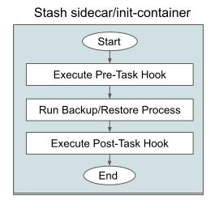
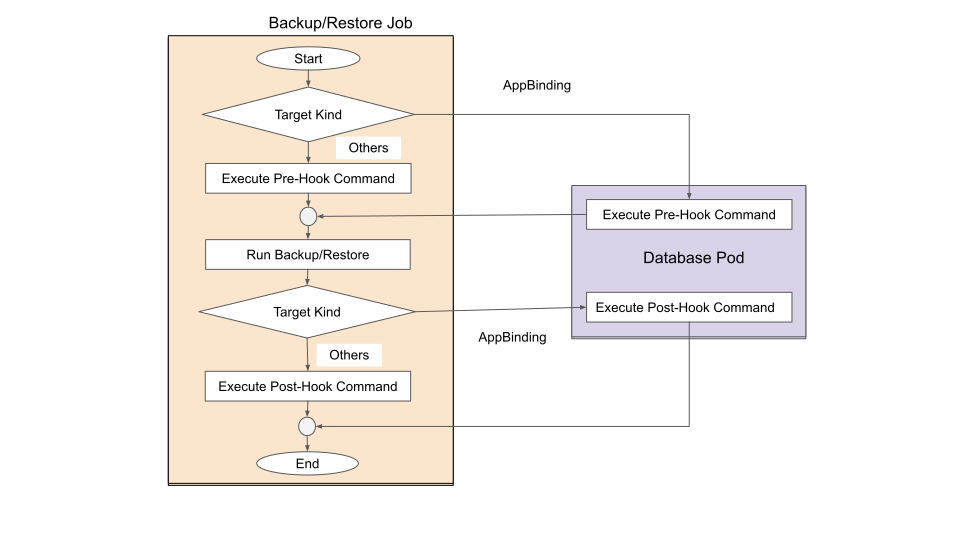
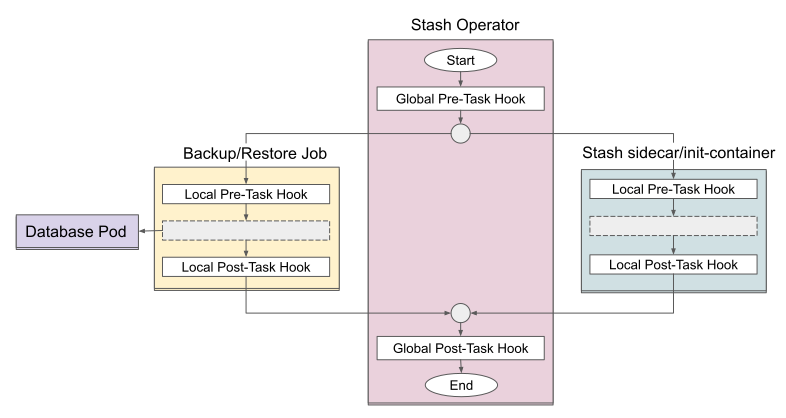

# Stash Backup and Restore Hooks

Stash `v0.9.0+` supports executing custom commands before and after backup or restore process. This is called `hook` in Stash. This guide will give you an overview of what kind of hooks you can execute, how the hooks get executed, and how the hooks behave in different scenarios.

## Types of Hooks

We can categorize Stash backup and restore hooks based on the action they perform and based on their execution order.

### Based on Action

Based on the action of a hook, we can categorize them into four different categories. These are the followings:

- **HTTPGet:** Executes an HTTP GET request before/after the backup/restore process. The hook is considered successful if the return code is between `200` and `400`.

- **HTTPPost:** Executes an HTTP POST request before/after the backup/restore process. Like `HTTPGet`, the hook is considered successful if the return code is between `200` and `400`.

- **TCPSocket:** Performs a TCP check against the provided URL on a specific port before/after the backup/restore process. The hook is considered successful if the targeted port is open.

- **Exec:** Executes commands inside a targeted container before/after the backup/restore process. The hook is considered successful if the command executes with exit code 0.

### Execution Phases

Based on the execution order, we can categorize the hooks into two different phases. These are the followings:

- **Pre-Task Hook:** Pre task hooks are executed before the backup or restore process. `preBackup` and `preRestore` are the pre-task hooks.

- **Post-Task Hook:** Post task hooks are executed after the backup or restore process. `postBackup` and `postRestore` are the post-task hooks.

However, there is one more type of hooks for [BackupBatch](/docs/concepts/crds/backupbatch.md) object. We call them **Global Hooks**. They get executed before any other individual target's hooks get executed (for the pre-task hooks) or after all the individual target's hooks has executed (for the post-task hooks).

## Who Executes the Hooks

You might be familiar that Stash uses two different models to take backup of the target based on their type. For Kubernetes workloads (i.e. Deployment, DaemonSet, StatefulSet etc.), Stash injects a sidecar into the workload that takes backup. However, for databases and standalone PVC backup, Stash creates a job for the task. The hooks are executed differently for these two different models.

Furthermore, we have introduced [BackupBatch](/docs/concepts/crds/backupbatch.md) which allows to specify multiple target simultaneously. The individual targets may follow the sidecar model or the job model. The `BackupBatch` object allows specifying a global hook for all the targets as well as some local hooks for individual targets. This type of hooks also handled differently.

Here, we are going to discuss how Stash executes the hooks in different scenarios.

- **Sidecar Model:** In sidecar model, hooks are executed by the backup sidecar or restore init-container. The hook execution flow by sidecar/init-container is shown in the following diagram:

  <figure align="center">
    
  <figcaption align="center">Fig: Hook Execution flow in sidecar model</figcaption>
  </figure>

- **Job Model:** In Job model, `httpGet`, `httpPost` and `tcpSocket` are executed by the backup/restore job. However, the `exec` hook is executed in the targeted application pod. In order to determine the targeted application pod, Stash uses the `Service` specified in the respective `AppBinding` crd. It first determines the endpoints of the Service. Then, it executes  the hook into one of the pod pointed by those endpoints. Hence, if the `AppBinding` points to an external URL, it is not possible for Stash to execute the `exec` hook. The hook execution flow in job model is shown in the following diagram:

  <figure align="center">
    
  <figcaption align="center">Fig: Hook Execution flow in job model</figcaption>
  </figure>

- **Batch Backup:** In batch backup using `BackupBatch` object, the global hooks are executed by the Stash operator itself. When Stash operator completes executing the global pre-task hook, the individual targets start executing their local pre-task hook. Then, they complete their backup process and executes their local post-task hook. Finally, the Stash operator executes global post-task hooks. The hook execution flow in batch backup is shown in the following diagram:

<figure align="center">
  
<figcaption align="center">Fig: Hook Execution flow in batch backup</figcaption>
</figure>

## Hook's Behaviors

Now, we are going to discuss what will happen when a hook fails or backup/restore process fails.

### `preBackup` or `preRestore` hook

If a `preBackup` or `preRestore` hook fails to execute, the rest of the backup/restore process will be skipped and the respective `BackupSession`/`RestoreSession` will be marked as `Failed`. You may see the following things happen in addition to skipping the backup process:

- **Backup Sidecar:** If the `preBackup` hook fails in the backup sidecar, the sidecar will just log the failure and continue watching for `BackupSession` for the next backup.
- **Restore Init-Container:** If the `preRestore` hook fails in restore init-container, the container will crash. Hence, your workload will be stuck in the initialization phase.
- **Backup or Restore Job:** If the `preBackup` or `preRestore` hook fails in backup/restore job, the container will fail. Hence, the job will never go into completed stage. You may see the job creating multiple pods to retry.

### `postBackup` or `postRestore` hook

If the backup or restore process fails then the respective `postBackup` or `postRestore` hook will be executed according to the policy specified in the `executionPolicy` field of the respective hook. The current acceptable values and behaviors are:

- `Always`: The hook will be executed after the backup/restore process no matter the backup/restore has failed or succeeded. This is the default behavior.
- `OnSuccess`: The hook will be executed after the backup/restore process only if the backup/restore has succeeded.
- `OnFailure`: The hook will be executed after the backup/restore process only if the backup/restore has failed.

If the `postBackup` or `postRestore` hook fails, the respective BackupSession or RestoreSession will be marked as `Failed`.

## Templating Support in Hook

Stash support [Go template](https://pkg.go.dev/text/template) in hook. This is particularly helpful when you want to send custom message to a Slack webhook with information about the backup/restore session.

Stash exposes a summary for a backup/restore process. The Go template variables are then resolved from the summary. Here, is an example of a summary exposed by Stash:

```json
{
    "name": "deployment-backup-1646741400",
    "namespace": "demo",
    "invoker":{
        "apiGroup": "stash.appscode.com",
        "kind": "BackupConfiguration",
        "name": "deployment-backup"
    },
    "target":{
        "apiVersion": "apps/v1",
        "kind": "Deployment",
        "name": "stash-demo"
    },
    "status":{
        "phase": "Failed",
        "duration": "10s",
        "error": "failed to backup host-0. Reason: path not found"
    }
}
```

The summary contains the following fields:

- **name:** Name of the respective BackupSession or RestoreSession. You can access it in your template as `.Name` variable.
- **namespace:** Namespace of the respective BackupSession or RestoreSession. You can access it in your template as `.Namespace` variable.
- **invoker:** Contains the respective BackupConfiguration or RestoreSession information which is responsible for triggering this backup or restore process. It has the following fields:
  - **apiVersion:** API version of the invoker. You can access it in your template as `.Invoker.ApiVersion` variable.
  - **kind:** Kind of the invoker. You can access it in your template as `.Invoker.Kind` variable.
  - **name:** Name of the invoker. You can access it in your template as `.Invoker.Name` variable.

- **target:** Contains respective backup/restore target information. It has the following fields:
  - **apiVersion:** API version of the target. You can access it in your template as `.Target.ApiVersion` variable.
  - **kind:** Kind of the target. You can access it in your template as `.Target.Kind` variable.
  - **name:** Name of the target. You can access it in your template as `.Target.Name` variable.

- **status:** Specifies the backup/restore status. It has the following fields:
  - **phase:** Phase of the backup/restore process. You can access it in your template as `.Status.Phase` variable.
  - **duration:** Specifies how long it took to complete the backup/restore process. You can access it in your template as `Status.Duration` variable.
  - **error:** If the backup/restore process fail, this field contains the reason why it failed. You can access it in your template as `.Status.Error` variable.

Below is an example of using Go template in hook. Here, we are sending a message to a slack incoming webhook if the backup process fails.

```yaml
hooks:
  postBackup:
    executionPolicy: OnFailure
    httpPost:
      host: hooks.slack.com
      path: /services/XX/XXX/XXXX
      port: 443
      scheme: HTTPS
      httpHeaders:
        - name: Content-Type
          value: application/json
      body: |
          {{- $msg := dict  "type" "mrkdwn" "text" (printf ":x: Backup failed for %s/%s Reason: %s." .Namespace .Target.Name .Status.Error) -}}
          {
            "blocks": [
                {
                  "type": "section",
                  "text": {{ toJson $msg }}
                }
              ]
          }
```
