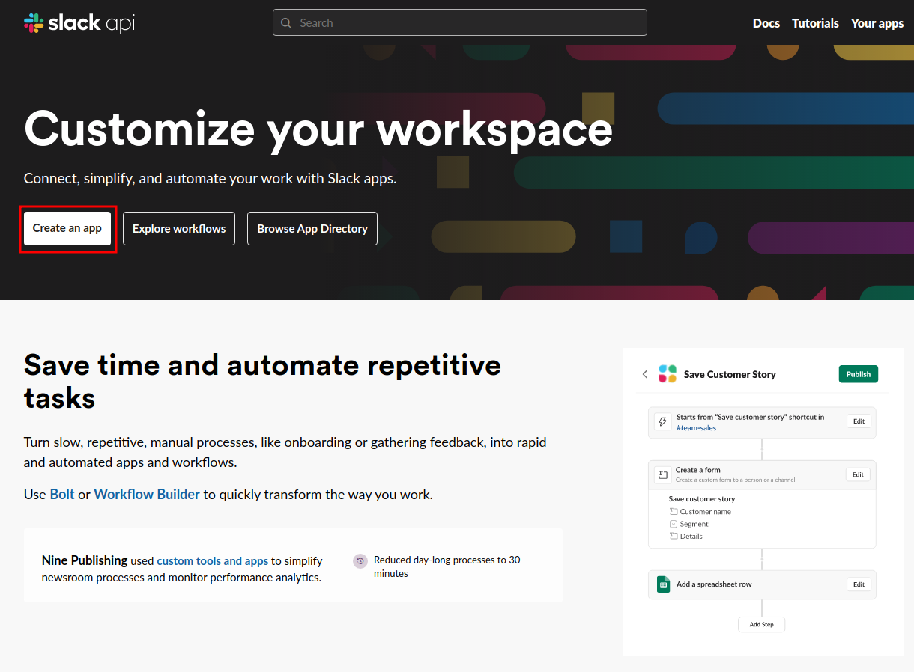
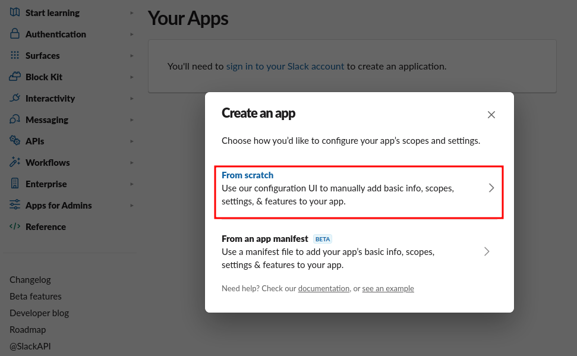
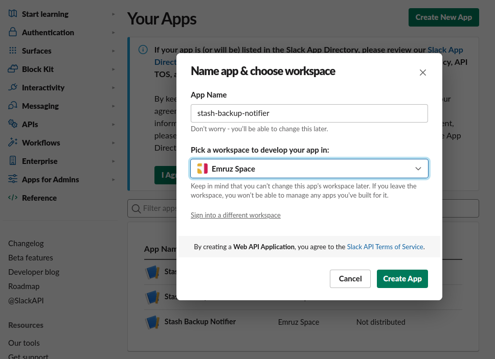
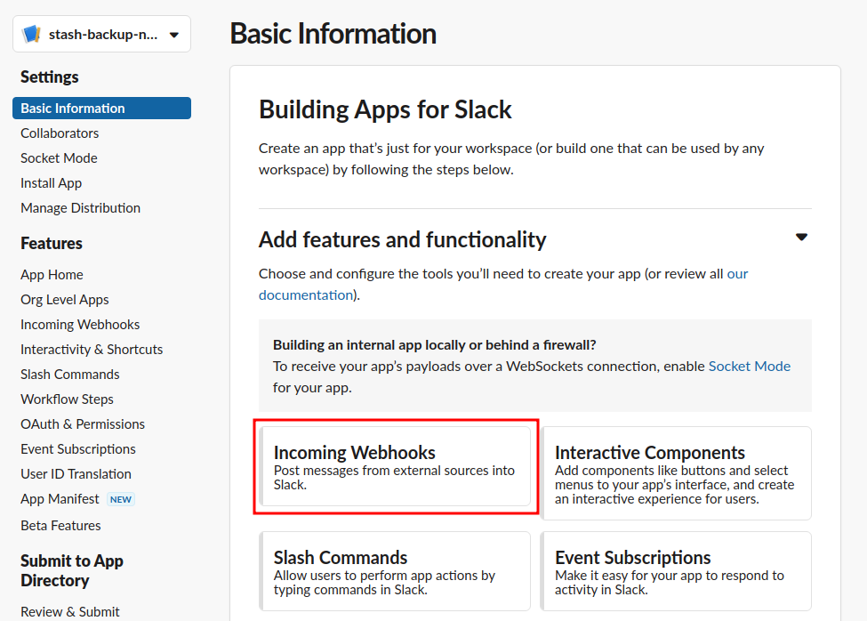
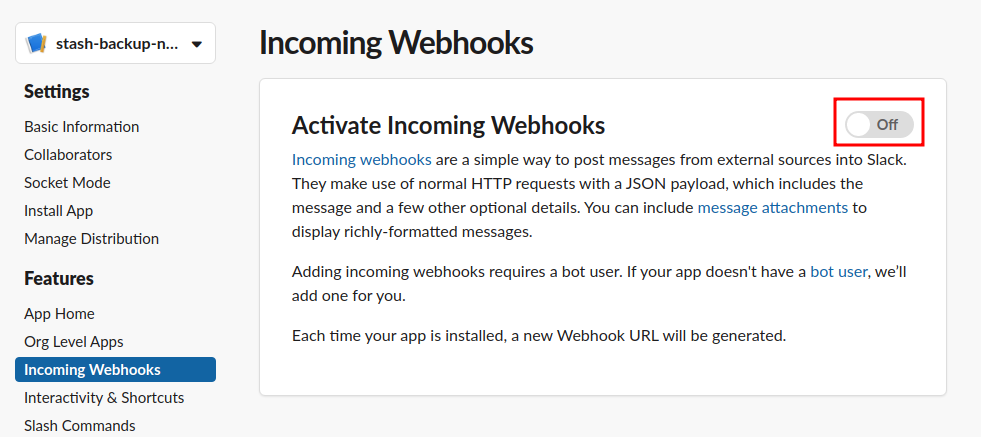
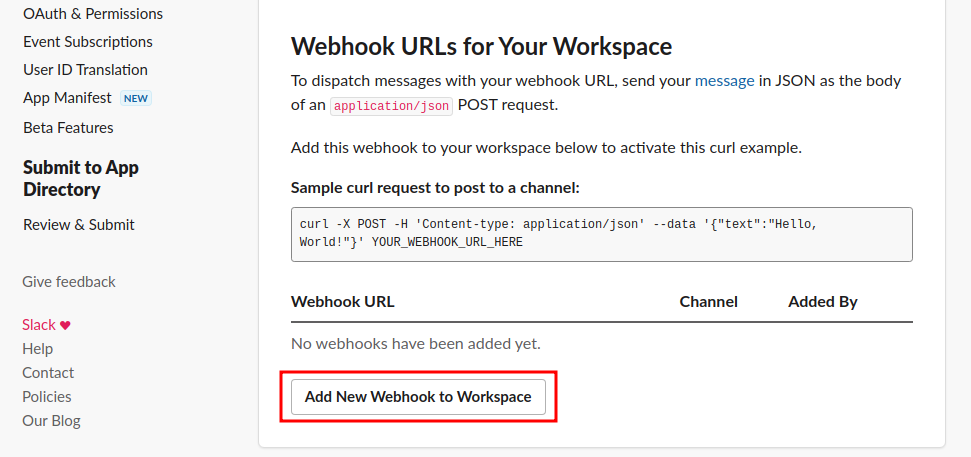
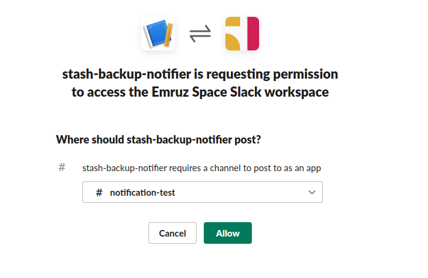
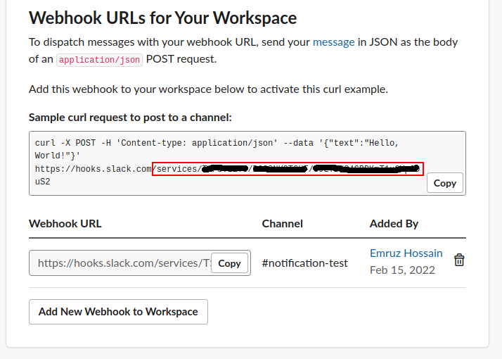
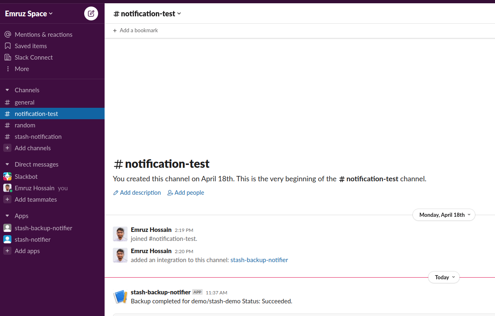
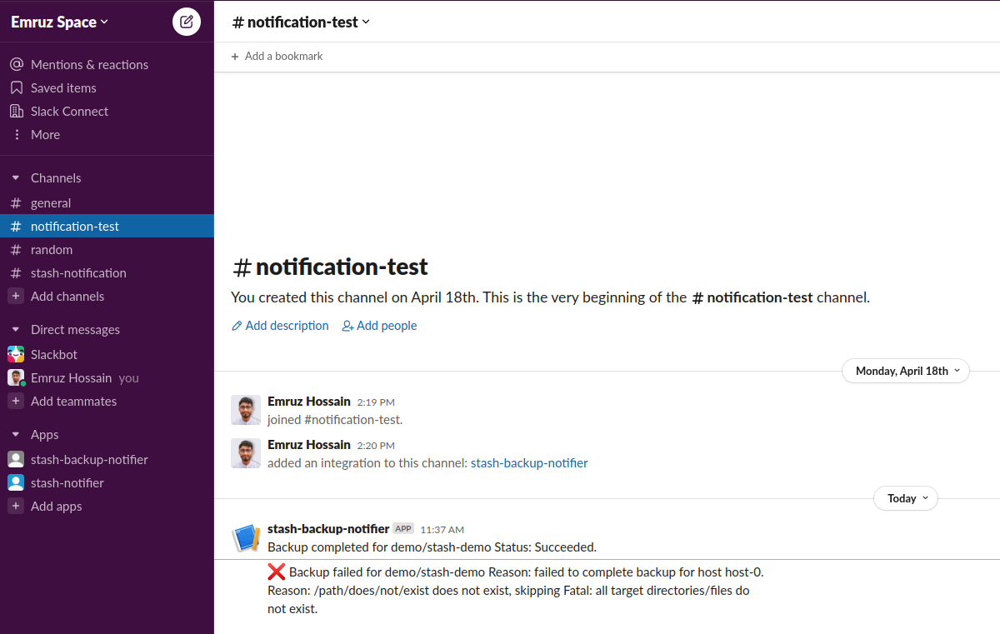

# Sending Backup Notification to Slack Channel

In this guide, we are going to show you how to send backup notifications to a Slack channel. Here, we are going to use [Slack Incoming Webook](https://api.slack.com/messaging/webhooks) to send the notification.

## Before You Begin

- At first, you need to have a Kubernetes cluster, and the `kubectl` command-line tool must be configured to communicate with your cluster. If you do not already have a cluster, you can create one by using [kind](https://kind.sigs.k8s.io/docs/user/quick-start/).
- Install Stash Enterprise in your cluster following the steps [here](/docs/setup/install/enterprise.md).
- If you haven't read about how hooks work in Stash, please check it from [here](/docs/guides/hooks/overview/index.md).

You should be familiar with the following `Stash` concepts:

- [BackupBatch](/docs/concepts/crds/backupbatch.md)
- [BackupSession](/docs/concepts/crds/backupsession.md)
- [Repository](/docs/concepts/crds/repository.md)
- [Function](/docs/concepts/crds/function.md)
- [Task](/docs/concepts/crds/task.md)

To keep everything isolated, we are going to use a separate namespace called `demo` throughout this tutorial.

```bash
$ kubectl create ns demo
namespace/demo created
```

## Configure Slack Incoming Webhook

At first, let's configure a Slack incoming webhook. We are going to send the notifications to a channel named `notification-test`. Now, follow the steps below:

- Go to https://api.slack.com/ and click the `Create an app` button as highlighted in the red rectangle in the following image.

<figure align="center">
  
</figure>

- We are going to build a new app. So, select the `From scratch` option as below.

<figure align="center">
  
</figure>

- Now, give your app a name and select your workspace.

<figure align="center">
  
</figure>

- Then, select your application type as `Incoming Webhooks`.

<figure align="center">
  
</figure>

- Now, activate your incoming webhook.

<figure align="center">
  
</figure>

- Scroll down and click on the `Add New Webhook to Workspace` button.

<figure align="center">
  
</figure>

- Now, select your desired Slack channel where you want to send the notifications. Then, click on the  `Allow` button.

<figure align="center">
  
</figure>

- Finally, copy the webhook path starting from `/service/****`. We will use this path in our hook specification.

<figure align="center">
  
</figure>

Our Slack incoming webhook is ready to receive notifications. In the next section, we are going to configure a Stash webhook to send backup notifications to this incoming webhook.

## Prepare Application

Now, let's deploy a sample application and generate some sample data for it. Here, is the YAML of a Deployment along with its PVC that we are going to deploy:

```yaml
kind: PersistentVolumeClaim
apiVersion: v1
metadata:
  name: stash-sample-data
  namespace: demo
spec:
  accessModes:
  - ReadWriteOnce
  resources:
    requests:
      storage: 1Gi
---
apiVersion: apps/v1
kind: Deployment
metadata:
  labels:
    app: stash-demo
  name: stash-demo
  namespace: demo
spec:
  replicas: 1
  selector:
    matchLabels:
      app: stash-demo
  template:
    metadata:
      labels:
        app: stash-demo
      name: busybox
    spec:
      containers:
      - args: ["sleep 3000"]
        command: ["/bin/sh", "-c"]
        image: busybox
        imagePullPolicy: IfNotPresent
        name: busybox
        volumeMounts:
        - mountPath: /source/data
          name: source-data
      restartPolicy: Always
      volumes:
      - name: source-data
        persistentVolumeClaim:
          claimName: stash-sample-data
```

Let's deploy the above deployment.

```bash
❯ kubectl apply -f https://github.com/stashed/docs/raw//docs/guides/hooks/slack-notification/examples/deployment.yaml
persistentvolumeclaim/stash-sample-data created
deployment.apps/stash-demo created
```

Once the deployment is running, lets exec into its pod and create some sample file in `/source/data` directory.

```bash
❯ kubectl exec -n demo stash-demo-669d77dfc4-nhdgg -- touch /source/data/file-1.txt
❯ kubectl exec -n demo stash-demo-669d77dfc4-nhdgg -- touch /source/data/file-2.txt
❯ kubectl exec -n demo stash-demo-669d77dfc4-nhdgg -- touch /source/data/file-3.txt
```

Let's verify that the files have been created successfully:

```bash
❯ kubectl exec -n demo stash-demo-669d77dfc4-nhdgg -- ls /source/data
file-1.txt
file-2.txt
file-3.txt
```

Our application is ready with some sample data. In the next section, we are going to setup a backup for this application.

## Prepare Backend

We are going to store our backed-up data into a GCS bucket. At first, we need to create a secret with GCS credentials then we need to create a `Repository` CR. If you want to use a different backend, please read the respective backend configuration doc from [here](/docs/guides/backends/overview.md).

**Create Storage Secret:**

Let's create a secret called `gcs-secret` with access credentials to our desired GCS bucket,

```bash
$ echo -n 'changeit' > RESTIC_PASSWORD
$ echo -n '<your-project-id>' > GOOGLE_PROJECT_ID
$ cat /path/to/downloaded-sa-key.json > GOOGLE_SERVICE_ACCOUNT_JSON_KEY
$ kubectl create secret generic -n demo gcs-secret \
    --from-file=./RESTIC_PASSWORD \
    --from-file=./GOOGLE_PROJECT_ID \
    --from-file=./GOOGLE_SERVICE_ACCOUNT_JSON_KEY
secret/gcs-secret created
```

**Create Repository:**

Now, create a `Repository` using this secret. Below is the YAML of Repository CR we are going to create,

```yaml
apiVersion: stash.appscode.com/v1alpha1
kind: Repository
metadata:
  name: gcs-repo
  namespace: demo
spec:
  backend:
    gcs:
      bucket: stash-testing
      prefix: /webinar/slack-notification
    storageSecretName: gcs-secret
```

Let's create the `Repository` we have shown above,

```bash
$ kubectl apply -f https://github.com/stashed/docs/raw//docs/guides/hooks/slack-notification/examples/repository.yaml
repository.stash.appscode.com/gcs-repo created
```

Now, we are ready to backup our application into our desired backend.

## Backup

In this section, we are going to setup a backup for the application we deployed earlier. We are going to configure a `postBackup` hook to send a notification to our Slack incoming webhook when a backup session completes.

Here, is the YAML of the BackupConfiguration that we are going to create:

```yaml
apiVersion: stash.appscode.com/v1beta1
kind: BackupConfiguration
metadata:
  name: deployment-backup
  namespace: demo
spec:
  repository:
    name: gcs-repo
  schedule: "*/5 * * * *"
  target:
    ref:
      apiVersion: apps/v1
      kind: Deployment
      name: stash-demo
    volumeMounts:
    - name: source-data
      mountPath: /source/data
    paths:
    - /source/data
  hooks:
    postBackup:
      executionPolicy: Always
      httpPost:
        host: hooks.slack.com
        path: /services/XX/XXX/XXXX
        port: 443
        scheme: HTTPS
        httpHeaders:
          - name: Content-Type
            value: application/json
        body: |
          {{- $msg := dict  "type" "mrkdwn" "text" (printf "Backup completed for %s/%s Status: %s." .Namespace .Target.Name .Status.Phase) -}}
          {
            "blocks": [
                {
                  "type": "section",
                  "text": {{ toJson $msg }}
                }
              ]
          }
  retentionPolicy:
    name: 'keep-last-5'
    keepLast: 5
    prune: true
```

Notice the `hooks` section. We have setup a `postBackup` hook which sends an HTTP POST request. In the `path` field of the `httpPost` section, we have specified the Slack incoming webhook path that we copied in the last step of configuring Slack incoming webhook.

Also, notice the `body` field of the `httpPost` section. We have used Go template to include information about the backup target and status.

Let's create the BackupConfiguration we have shown above,

```bash
❯ kubectl apply -f https://github.com/stashed/docs/raw//docs/guides/hooks/slack-notification/examples/all_backup_notification.yaml
backupconfiguration.stash.appscode.com/deployment-backup created
```

**Wait for BackupSession:**

Now, let's wait for a BackupSession. Run the following command to watch for BackupSession.

```bash
❯ kubectl get backupsession --all-namespaces -w
NAMESPACE   NAME                           INVOKER-TYPE          INVOKER-NAME        PHASE   DURATION   AGE
demo        deployment-backup-1650277200   BackupConfiguration   deployment-backup                      0s
demo        deployment-backup-1650277200   BackupConfiguration   deployment-backup   Pending              0s
demo        deployment-backup-1650277200   BackupConfiguration   deployment-backup   Running              0s
demo        deployment-backup-1650277200   BackupConfiguration   deployment-backup   Succeeded   31s      30s
```

We can see from the above output that the backup session has succeeded.

**Verify Notification:**

Now, if we go to the Slack channel we have configured for notification. We should see a notification similar to this:

<figure align="center">
  
</figure>

### Sending Only Backup Failure Notification

We can also use the `executionPolicy` to send notification only for the failed backups. Check the following BackupConfiguration:

```yaml
apiVersion: stash.appscode.com/v1beta1
kind: BackupConfiguration
metadata:
  name: deployment-backup
  namespace: demo
spec:
  repository:
    name: gcs-repo
  schedule: "*/5 * * * *"
  target:
    ref:
      apiVersion: apps/v1
      kind: Deployment
      name: stash-demo
    volumeMounts:
    - name: source-data
      mountPath: /source/data
    paths:
    - /path/does/not/exist
  hooks:
    postBackup:
      executionPolicy: OnFailure
      httpPost:
        host: hooks.slack.com
        path: /services/XX/XXX/XXXX
        port: 443
        scheme: HTTPS
        httpHeaders:
          - name: Content-Type
            value: application/json
        body: |
          {{- $msg := dict  "type" "mrkdwn" "text" (printf ":x: Backup failed for %s/%s Reason: %s." .Namespace .Target.Name .Status.Error) -}}
          {
            "blocks": [
                {
                  "type": "section",
                  "text": {{ toJson $msg }}
                }
              ]
          }
  retentionPolicy:
    name: 'keep-last-5'
    keepLast: 5
    prune: true
```

Here, we have provided an invalid path in the `paths` field of the `target` section. This will force the backup to fail.

Notice that, this time we have specified the `executionPolicy` field to `OnFailure`. This will tell Stash to send the notification only if the backup fail. In the message body, we have included information about target and reason of failure.

Let's apply the above BackupConfiguration:

```bash
❯ kubectl apply -f https://github.com/stashed/docs/raw//docs/guides/hooks/slack-notification/examples/failed_backup_notification.yaml
backupconfiguration.stash.appscode.com/deployment-backup configured
```

**Wait for BackupSession:**

Again, let's wait for a scheduled backup. Run the following command to watch for a BackupSession:

```bash
❯ kubectl get backupsession --all-namespaces -w
NAMESPACE   NAME                           INVOKER-TYPE          INVOKER-NAME        PHASE   DURATION   AGE
demo        deployment-backup-1650277554   BackupConfiguration   deployment-backup                      0s
demo        deployment-backup-1650277554   BackupConfiguration   deployment-backup   Pending              0s
demo        deployment-backup-1650277554   BackupConfiguration   deployment-backup   Running              5s
demo        deployment-backup-1650277554   BackupConfiguration   deployment-backup   Failed    6s         5s
```

As we can see that the backup has failed this time. Let's verify the failure notification.

**Verify Notification:**

If we go to the Slack channel, we should see a new notification has been sent. This time it indicates a failure and also contains the failure reason.

<figure align="center">
  
</figure>

## Cleanup

To clean up the test resources we have created throughout this tutorial, run the following commands:

```bash
# Delete BackupConfiguration
kubectl delete backupconfiguration -n demo deployment-backup
# Delete Repository
kubectl delete repository -n demo gcs-repo
# Delete storage Secret
kubectl delete secret -n demo gcs-secret

# Delete Deployment and it's PVC
kubectl delete deployment -n demo stash-demo
kubectl delete pvc -n demo stash-sample-data
```
