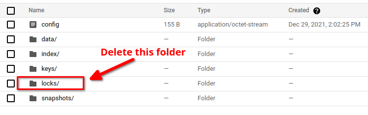

# Troubleshooting `"repository is already locked "` issue

Sometimes, the backend repository get locked and subsequent backup fail. In this guide, we are going to explain why this can happen and what you can do to solve the issue.

## Identifying the issue

If the repository get locked, new backup will fail. If you describe the `BackupSession`, you should see error message indicating that the repository is already locked by other process.

```bash
kubectl describe -n <namespace> backupsession <backupsession name>
```

You will also see the error message in the backup sidecar/job log.

```bash
# For backup that uses sidecar (i.e. Deployment, StatefulSet etc.)
kubectl logs -n <namespace> <workload pod name> -c stash

# For backup that uses job (i.e. Database, PVC, etc.)
kubectl logs -n <namespace> <backup job's pod name> --all-containers
```

## Possible reasons

A restic process that modify the repository, create a lock at the beginning it's operation. When it completes the operation, it remove the lock so that other restic process can use the repository. Now, if the process is killed unexpectedly, it can not remove the lock. As a result, the repository remains locked and become unusable for other process.

### Possible scenarios when a repository can get locked

The repository can get locked in the following scenarios.

#### 1. The backup job/pod containing sidecar has been terminated.

If the workload pod that has `stash` sidecar or backup job's pod get terminated while a backup is running, the repository can get locked. In this case, you have to find out why the pod was terminated.

#### 2. The temp-dir is set too low

Stash uses an `emptyDir` as temporary volume where it store cache for improving backup performance. By default the `emptyDir` does not have any limit on size. However, if you set the limit manually using `spec.tempDir` section of `BackupConfiguration` make sure you have set it to a reasonable size based on your targeted data size. If the `tempDir` limit is too low, cache size may cross the limit resulting the backup pod get evicted by Kubernetes. This is a tricky case because you may not notice that the backup pod has been evicted. You can describe the respective workload/job to check if it was the case.

In such scenario, make sure that you have set the `tempDir` size to a reasonable amount. You can also disable caching by setting `spec.tempDir.disableCaching: true`. However, this might impact the backup performance significantly.

## Solutions

If your repository get locked, you have to unlock it manually. You can use one of the following methods.

### Use Stash kubectl plugin

At first, install the Stash `kubectl` plugin by following the instruction [here](https://stash.run/docs/latest/setup/install/kubectl_plugin/).

Then, run the following command to unlock the repository:

```bash
kubectl stash unlock <repository name> --namespace=<namespace>
```

### Delete the locks folder from backend

If you are using a cloud bucket that provide a UI to browse the storage, you can go to the repository directory and delete the `locks` folder.

<figure align="center">
  
<figcaption align="center">Fig: Locks in the backend repository</figcaption>
</figure>

## Further Action

Once you have found the issue why the repository got locked in the fist place, take necessary measure to prevent it from occurring in future.
