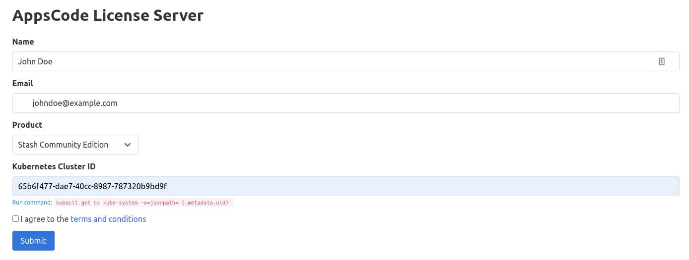

# Install Stash Community Edition

Stash Community edition is available under [AppsCode-Community-1.0.0](https://github.com/appscode/licenses/raw/1.0.0/AppsCode-Community-1.0.0.md) license and free to use for both commercial and non-commercial purposes. It comes with all the basic backup functionalities. However, it lacks some advanced features such as [Database Backup](/docs/guides/addons/overview/index.md), [Auto-Backup](/docs/guides/auto-backup/overview/index.md), [Batch Backup](/docs/guides/batch-backup/overview/index.md), and [Local Backend](/docs/guides/backends/local.md) support, etc. compared to the Enterprise edition. A full features comparison between the Stash Community edition and Enterprise edition can be found [here](/docs/concepts/what-is-stash/overview/index.md).

To use Stash Community edition, you can grab **1 year** free license from [here](https://license-issuer.appscode.com/?p=stash-community).

## Prerequisites

- **Kubernetes version**: Stash is compatible with any Kubernetes cluster with version `1.16` or later.
- **Extended API server**: Your cluster needs to support Kubernetes extended API server.
- **Webhook support**: Your cluster must support Kubernetes validation and mutation webhooks.
- **RBAC permissions**: Stash operator needs a few RBAC permissions on your cluster. You can find the list of the required RBAC permissions [here](/docs/guides/security/rbac.md).
- **Installing on GKE cluster**: To install Stash on your GKE cluster, please check the requirements [here](https://stash.run/docs//setup/install/troubleshoting/#installing-in-gke-cluster).
- **NFS volume**: If you are willing to use NFS volume as a backend, you need to customize the Stash installation like [here](https://stash.run/docs//setup/install/troubleshoting/#configuring-network-volume-accessor).

## Get a License

In this section, we are going to show you how you can get a **1 year** free license for Stash Community edition. You can get a license for your Kubernetes cluster by going through the following steps:

- At first, go to [AppsCode License Server](https://license-issuer.appscode.com/?p=stash-community) and fill up the form. It will ask for your Name, Email, the product you want to install, and your cluster ID (UID of the `kube-system` namespace).
- Provide your name and email address. You can provide your personal or work email address.
- Then, select `Stash Community Edition` in the product field.
- Now, provide your cluster ID. You can get your cluster ID easily by running the following command:

```bash
kubectl get ns kube-system -o=jsonpath='{.metadata.uid}'
```

- Then, you have to agree with the terms and conditions. We recommend reading it before checking the box.
- Now, you can submit the form. After you submit the form, the AppsCode License server will send an email to the provided email address with a link to your license file.
- Navigate to the provided link and save the license into a file. Here, we save the license to a `license.txt` file.

Here is a screenshot of the license form.

<figure align="center">
  
  <figcaption align="center">Fig: Stash License Form</figcaption>
</figure>

You can create licenses for as many clusters as you want. You can upgrade your license any time without re-installing Stash by following the upgrading guide from [here](/docs/setup/upgrade/index.md#upgrading-license).

> Stash licensing process has been designed to work with CI/CD workflow. You can automatically obtain a license from your CI/CD pipeline by following the guide from [here](https://github.com/appscode/offline-license-server#offline-license-server).

## Install

Stash operator can be installed as a Helm chart or simply as Kubernetes manifests.

<ul class="nav nav-tabs" id="installerTab" role="tablist">
  <li class="nav-item">
    <a class="nav-link active" id="helm3-tab" data-toggle="tab" href="#helm3" role="tab" aria-controls="helm3" aria-selected="true">Helm 3 (Recommended)</a>
  </li>
  <li class="nav-item">
    <a class="nav-link" id="script-tab" data-toggle="tab" href="#script" role="tab" aria-controls="script" aria-selected="false">YAML</a>
  </li>
</ul>
<div class="tab-content" id="installerTabContent">
  <div class="tab-pane fade show active" id="helm3" role="tabpanel" aria-labelledby="helm3-tab">

## Using Helm 3

Stash can be installed via [Helm](https://helm.sh/) using the [chart](https://github.com/stashed/installer/tree//charts/stash) from [AppsCode Charts Repository](https://github.com/appscode/charts). To install the chart with the release name `stash`:

```bash
$ helm repo add appscode https://charts.appscode.com/stable/
$ helm repo update
$ helm search repo appscode/stash --version 
NAME            CHART VERSION         APP VERSION         DESCRIPTION
appscode/stash        Stash by AppsCode - Backup your Kubernetes native applications

$ helm install stash appscode/stash          \
  --version                 \
  --namespace kube-system                     \
  --set features.community=true               \
  --set-file global.license=/path/to/the/license.txt
```

To see the detailed configuration options, visit [here](https://github.com/stashed/installer/tree//charts/stash-community).

</div>
<div class="tab-pane fade" id="script" role="tabpanel" aria-labelledby="script-tab">

## Using YAML

If you prefer to not use Helm, you can generate YAMLs from Stash chart and deploy using `kubectl`. Here we are going to show the prodecure using Helm 3.

```bash
$ helm repo add appscode https://charts.appscode.com/stable/
$ helm repo update
$ helm search repo appscode/stash --version 
NAME            CHART VERSION         APP VERSION         DESCRIPTION
appscode/stash        Stash by AppsCode - Backup your Kubernetes native applications

$ helm template stash appscode/stash          \
  --version                 \
  --namespace kube-system                     \
  --set features.community=true               \
  --set global.skipCleaner=true               \
  --set-file global.license=/path/to/the/license.txt | kubectl apply -f -
```

To see the detailed configuration options, visit [here](https://github.com/stashed/installer/tree//charts/stash-community).

</div>
</div>

## Verify installation

To check if Stash operator pods have started, run the following command:

```bash
$ ❯ kubectl get pods --all-namespaces -l app.kubernetes.io/name=stash-community --watch
NAMESPACE     NAME                                     READY   STATUS    RESTARTS   AGE
kube-system   stash-stash-community-66b86d9647-kcncc   2/2     Running   0          2m6s
```

Once the operator pod is running, you can cancel the above command by typing `Ctrl+C`.

Now, to confirm CRD groups have been registered by the operator, run the following command:

```bash
$ kubectl get crd -l app.kubernetes.io/name=stash

NAME                                      CREATED AT
backupconfigurations.stash.appscode.com   2020-08-24T08:20:54Z
backupsessions.stash.appscode.com         2020-08-24T08:20:55Z
functions.stash.appscode.com              2020-08-24T08:20:55Z
recoveries.stash.appscode.com             2020-08-24T08:20:54Z
repositories.stash.appscode.com           2020-08-24T08:20:54Z
restics.stash.appscode.com                2020-08-24T08:20:54Z
restoresessions.stash.appscode.com        2020-08-24T08:20:55Z
tasks.stash.appscode.com                  2020-08-24T08:20:55Z
```

Now, you are ready to [take your first backup](/docs/guides/README.md) using Stash.
